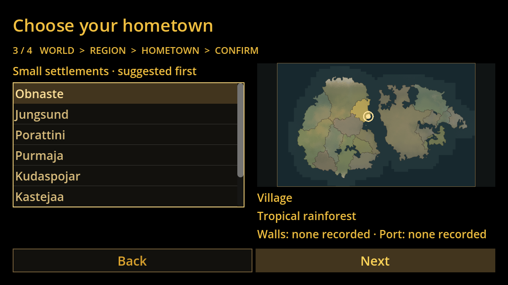
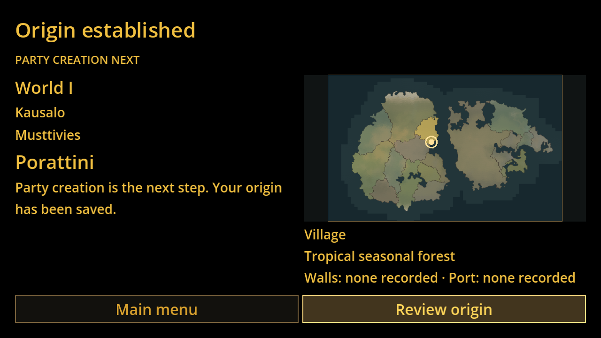

# GAME-74 — New Game origin V1

Production base: `238045b395ad9e693c71ac6b018442257fe0d6f3`.

Main menu now opens world → state/optional province → small hometown → review
→ independently persisted origin → **Party Creation Next**. Escape goes Back,
and at the world page returns to the menu. Enter activates focused controls;
arrows choose list entries; Tab navigates controls. Mouse works throughout.
Selections survive Back. Changing an earlier choice clears dependent choices.
The suggested first hometown is GAME-7's deterministic smallest-population,
then burg-ID ordering, not an optimisation recommendation. Eight candidates
are offered, with a scroll bar. No candidates means Back, never substitution.

## Boundaries and reuse

GameWorldTemplate retains canonical validation, eligibility, stable IDs and
source lookups. The sole foundation fix also excludes source `removed` burgs.
GamePlaythroughStore retains its unchanged state/save schema and three skeletal
adventurers. Only confirmation creates and atomically writes a save, using the
unique playthrough ID as slot; the new save is immediately reload-validated.
Write or immediate reload-validation failures stay on review and may be retried.
A failed reload never sets the validated saved slot or enters the handoff. The
newly written invalid slot is removed before retry; failed removal retains its
exact path and blocks another write or Back until cleanup succeeds. Reviewing a successfully saved
origin cannot create another save. Default persistence remains
`user://game_world_saves`; tests use isolated directories and remove their saves.

GAME-8 is handled by a narrow read-only atlas wrapper, with existing
MapRenderModel/MapRenderBaker output and source-cell political masks. There is
no layer browser, map inspection, clickable polygon dependency or debug UI.
Terrain and borders are renderer approximations at a fixed preview resolution;
the highlighted ownership comes from the actual source cell IDs. No POI layer
is loaded or rendered. A ring shows the actual burg coordinate. The preview
is contextual, not a calibrated scale map. No kilometres are assigned.

To keep world changes responsive, two deterministic previews are baked into
`assets/onboarding/`. Their source SHA guards against stale fixtures. Packed
cell IDs are explicitly binary for Windows checkout safety. Rebuild with:

```sh
godot --headless --audio-driver Dummy --path . --script tests/onboarding/bake-previews.gd
```

The two known templates are V1's complete catalogue. Player labels are World I and World II; fixture keys, seeds and immutable IDs
remain unchanged internally and in diagnostics. Hometowns show the source-backed
settlement type and terrain rather than a raw population/size number. Walls/ports
are described as present or none recorded, without inventing safety,
protection, factions, road access or danger. Continue remains disabled: a
player save browser and the next party-setup task are still required. The
handoff offers origin review and return to menu, not fake gameplay.

No character creation, party mechanics, world generation, research-stack
migration, navigation research changes or gameplay is included. Canonical
fixtures, accepted generators and application main scene are unchanged.
Draft PRs #51–#55 remain untouched.

## Executed QA

Godot **4.6.3 official Linux**, Mesa llvmpipe/Xvfb; real frames and input events,
not mocked screenshots. `logs/` contains the actual final run output.

- GAME-74: **3,973 checks, zero failures**: both immutable templates, deterministic
  states/provinces/homes, ownership, hidden/removed exclusion, unknown facts,
  stable IDs after rename, Back/invalidation, empty area, failed write/retry,
  one save per confirmation, same-origin independent saves and valid reloads.
- Post-write reload regression: **26 checks, zero failures**. Deliberately
  corrupts actual written JSON and uses the unchanged GAME-7 validator to reject
  it. Two failed attempts leave no slots or success claims; the next valid retry
  leaves exactly one reloadable save. A simulated cleanup error blocks extra
  writes and Back, then recovery deletes the failed slot and completes one save.
- Real Godot UI: **17 checks, zero failures**: intro skip, menu Enter, world
  arrows, state popup keyboard selection, mouse Next/hometown selection,
  Escape/Back, confirmation, persisted handoff, review without duplicate save,
  main-menu return, cancellation and empty-area rendering.
- Existing GAME-7 smoke: PASS. Existing landmark-inspection smoke: PASS.
- Canonical JSON: **5 tests passed**; both fixture validators passed.
- Project editor import: passed; no script/runtime errors. The virtual display
  emits only the expected unsupported V-Sync warning.
- Canonical hashes remain pinned and byte-identical to the production base.

`persistence-proof.json` records the actual distinct IDs and reloaded origin.
Test saves are removed after verification. Run again from the repository root:

```sh
python3 tests/onboarding/run-tests.py
DISPLAY=:74 python3 tests/onboarding/run-tests.py --visual
# Or: xvfb-run -a -s '-screen 0 3840x2160x24' python3 tests/onboarding/run-tests.py --visual
```

The runner fails on nonzero process exit or any Godot ERROR, regardless of
assertion totals. CI additionally verifies the official executable archive's
SHA256 before running the same checks.

## Actual screenshot sequence

The flow is exercised end-to-end in a real Godot run. This review pass refreshed
only screenshots with changed wording (world, hometown, review, handoff and
scaled handoff). Main-menu, region and empty-area screenshots remain unchanged. The 640×360 and
2560×1440 shots use the same logical responsive layout, after window resizing.
All were visually inspected; the focus-style obscuring text found during QA
was corrected before these final captures.

| Screen | Evidence |
|---|---|
| Main menu / New Game | [01](screenshots/01-main-menu.png) |
| World | [02](screenshots/02-world.png) |
| State and province / gold highlight | [03](screenshots/03-region.png) |
| Hometown | [04](screenshots/04-hometown.png) |
| Review | [05](screenshots/05-confirm.png) |
| Origin established | [06](screenshots/06-established.png) |
| 640×360 | [07 small](screenshots/07-established-640x360.png) |
| 2560×1440 | [07 large](screenshots/07-established-2560x1440.png) |
| Genuine no-home province | [08](screenshots/08-no-hometowns.png) |




## Windows Godot 4.6.3 review

1. Check out this feature branch, import `project.godot` in Godot 4.6.3 and run
   the project with **F5** (the unchanged intro is the main scene).
2. Escape skips intro after its initial fade. New Game is focused; press Enter.
3. Choose either template with arrows or mouse. Next → select a state and
   optional province. Verify the gold area highlight follows selection.
4. Next → choose a hometown with arrows or mouse. Escape returns to region;
   Next preserves the valid hometown. Check the ring and factual summary.
5. Next → review. Back creates no save. Escape repeatedly returns to the menu.
6. Repeat and Confirm Origin. Verify the Party Creation Next handoff. Review
   Origin and return create no second save. Start another game with the same
   template/home: confirm that a second JSON with a distinct ID exists in
   `%APPDATA%/Godot/app_userdata/Road Has Gone Dark/game_world_saves`.
7. Re-run at 640×360, 1280×720 and a larger desktop/window. Use Godot's window
   overrides or resize the game window. Verify controls, text and map placement.
8. For an empty area, World II → state Ris (ID 1) → province Grorjujen (ID 5) (the
   source-backed empty case shown by the automated diagnostic; inspect the
   selected names if canonical fixtures later change). Verify Back remains usable.
9. Underlying persistence smoke can be run from PowerShell:
   `& 'C:/path/to/Godot_v4.6.3-stable_win64_console.exe' --headless --audio-driver Dummy --path . --script tests/onboarding/verify-origin.gd`.

Native Windows/display scaling has **not** been executed in this Linux cloud.
The larger captures prove scaled Godot output, not Windows compositor behaviour.
No export preset exists in the base project. When packaging an executable,
include the canonical fixture JSON, `assets/onboarding/*.cells` and `*.sha256`
as non-resource export filters. PNGs are imported/preloaded resources. Packaging
and Continue browser implementation are deferred; project runs are verified.
