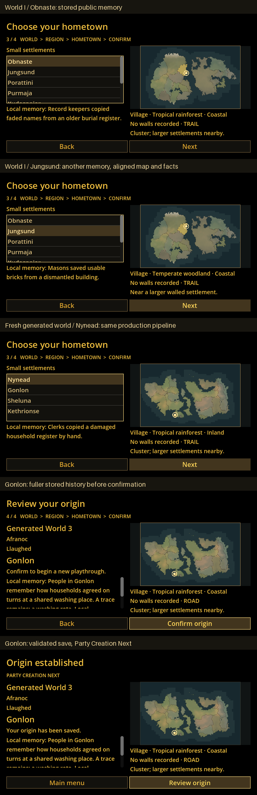

# Actual Godot review frames

These are captured Godot 4.6.3 frames, not concept artwork. The contact sheet adds captions outside the original frames; its high-resolution final panel is reduced for mobile review. Regenerate it with `python tests/world_enrichment/build-gallery.py` (QA-only Pillow).

## Original frames

| Case | Logical layout | Desktop |
|---|---|---|
| World I / Obnaste | [640×360](screenshots/hometown-0-640x360.png) | [1280×720](screenshots/hometown-0-1280x720.png) |
| World I / Jungsund | [640×360](screenshots/hometown-1-640x360.png) | [1280×720](screenshots/hometown-1-1280x720.png) |
| Fresh generated world / Nynead | [640×360](screenshots/hometown-20-640x360.png) | [1280×720](screenshots/hometown-20-1280x720.png) |
| Fresh generated world / Gonlon, confirmation | [640×360](screenshots/confirmation-640x360.png) | [1280×720](screenshots/confirmation-1280x720.png), [2560×1440](screenshots/confirmation-2560x1440.png) |
| Gonlon, validated save handoff | — | [2560×1440](screenshots/origin-established.png) |

The complete real-input run visits 22 towns (ten in each preset plus two in a fresh generated world), at all three resolutions. It checks rapid A/B/C/A changes, stable source IDs, aligned highlighted burg/facts/public lore, mouse and keyboard, Back/Escape, confirmation, validated persistence, Review Origin and returning to the menu. See [machine-readable proof](visual-proof.json) and [input/render log](logs/input-render.txt).

Comparison deliberately shows a short memory. Confirmation/handoff expose fuller memory and tradition through a bounded scroll area; the map and action buttons remain visible. These selected frames and the final desktop handoff were inspected directly. Windows CI validates native generation and persistence; Windows laptop visual acceptance remains for Mark.
