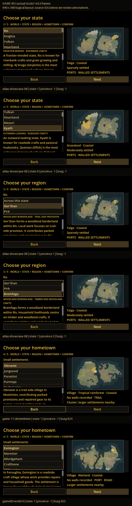

# GAME-80: persistent origin profiles

New Game presents state, region and hometown choices through persistent public identities. Geography/culture remains source-backed; political posture, livelihoods, institutions and customs are explicitly generated TRHGD background. These records confer no gameplay advantage.

Draft [PR #64](https://github.com/marksprietsma-beep/road-has-gone-dark/pull/64) stacks on GAME-79 branch `feature/game-79-production-world-enrichment-v1`, verified base `93951ba46a91219c5e33595dc4693b8c5d08c714`. Earlier PRs are untouched and unmerged.

The final source audit also verifies joint coastal-port evidence and recorded village/town/fort classes; [coastal-port review](coastal-port-review.json) and [settlement-class review](settlement-class-review.json) record the corrections.

Read [assessment](ASSESSMENT.md), [quality review](QUALITY-REVIEW.md), [sequential corpus](SEQUENTIAL-REVIEW.md), [machine-readable batch](batch-quality.json), [generated-world replay](generated-worlds.json), [visual proof](visual-proof.json) and [native distribution proof](distribution-proof.json).



Full-resolution frames are in [screenshots](screenshots). The contact sheet pastes unchanged 640×360 screenshots; its captions are evidence annotations, not player-facing UI. There are no fabricated landscapes. Linux uses Godot 4.6.3 with Mesa software rendering. Native Windows CI and a Windows laptop visual review are separate checks.

## Reused architecture and additive storage

GAME-77/78/79 hierarchical SHA seeds, Lexicon weighted combinators, declarative compatibility and Rant fact-bound rendering remain the foundation. No replacement generator or online service was added. The original runtime, pack, vendor files, V1 sidecars and canonical fixture bytes are unchanged.

```text
world.json                     immutable Azgaar identity
enrichment/origin-v1/           original GAME-79 package, unchanged
enrichment/profiles-v2/         additive state/region/hometown package
  enrichment.json              structured facts and evidence/provenance
  public.json                  allowlisted public summaries and source IDs
  descriptor.json              exact base/version/runtime/file pins + V1 dependency
```

The original `origin_enrichment` campaign reference remains intact. New campaigns also pin `origin_profiles`; an older V1-only campaign is accepted without adding or rewriting that field. The new reader validates complete authoritative political coverage, parent ownership, eligibility, source IDs/names, exact file/runtime hashes and the original V1 dependency. Public projection never contains private generator fields or marker note text.

New world publication requires both packages. A historical V1 world can gain only a missing V2 sibling for new onboarding; corrupt, incompatible or campaign-pinned packages are not replaced. Missing-package work shares the existing library lock and validates dependent campaigns before publication. A failed post-write reload remains on confirmation and retries the same written slot.

This is an explicit V2 extension, not a silent V1 migration. Future changes need a new pack/runtime identity and sidecar version, an explicit compatibility reader and retained exact historical runtime/content. Existing campaigns must never be regenerated against the newest templates. Changing display names does not change stable source IDs; changing canonical source bytes intentionally changes world identity. Field/entity generation order does not change content within one immutable world/version.

## Source constraints and hierarchy

`profile-context.mjs` aggregates actual mapped cells, public route membership, authoritative settlement flags and existing culture/religion IDs. Mapped cultural cell counts are not population shares, species ancestry or a demographic census. Unknown affiliations remain unknown. Public explicit mine markers permit mineral extraction; mountains, names and hidden sites do not. No ore type is inferred.

Forestry requires a meaningful forest-biome share; fishing requires actual coast/lake/river evidence; harbour commerce requires an actual port burg adjoining ocean water in the selected area; boatbuilding requires port, woodland and water. Farming/pastoral/reedwork use compatible terrain. Road provision uses actual public route-point cell membership, not an invented entrance or trade connection. Regional roles constrain livelihoods: a cultivated district cannot select fishing as its defining industry. Defensive posture requires source-backed walls; isolationist identity excludes cosmopolitan/maritime combinations.

State identities choose two distinct economic families, a compatible posture, social character and outward orientation. Regions specialise locally eligible parent work where possible, or contribute a concrete complementary product. Towns retain state social character while choosing a locally valid role, product contribution and public custom. A parent port never grants an inland child harbour work.

The original pack contains 14 livelihoods, 10 postures, 10 social characters, five orientations, 10 institutions, 14 region roles and 10 town customs. Rich GAME-78 site/character/NPC/item/contract/group domains remain available. `withProfiles(world, burgId, profiles)` supplies immutable hierarchical context and scope-prefixed identity tags to them; source prerequisites use the original local geography tags; no stat blocks, quest gameplay or faction simulation was added. All eight existing domains have executed smoke assertions.

## Player flow

The dark/gold state `ItemList` replaces the popup. State → region is explicit; lists update profile, factual summary and map wash together. Keyboard arrows/Enter, mouse and Escape/Back remain supported. A bounded scroll panel shows the stored full identity, then the original memory/tradition. Compact forms and short identity tags are stored separately. Source fixtures, seed hashes and developer provenance stay out of primary player text.

No eligible hometown means Back, never cross-region substitution. No profile package means factual browsing remains available but confirmation is blocked with an actionable error. Continue, character creation and gameplay remain deferred. The real application main scene is unchanged.

## Development and complete export

Build dependencies: Node **24.19.0**, Godot **4.6.3**, frozen Azgaar npm lockfile; Python/Pillow are QA/build tools only.

```sh
node tools/worldgen/bootstrap-helper.mjs
godot --editor --path .
```

Bootstrap obtains the checksum-pinned Node licence, installs frozen build dependencies if missing and provisions a compatible native `worldgen-helper`. Repetition is a verified no-op; an owned older helper is preserved, an unknown directory is refused. Preflight checks the native runtime, upstream Azgaar pin, both manifests and packaged enrichment files before generation. Players need no separately installed Node, browser, Python or internet.

```sh
python tools/release/prepare-templates.py
node tools/release/export-game.mjs --output /absolute/new/distribution
```

Export automatically includes the matching helper beside the game. `verify-origin-profiles.yml` tests Linux and Windows and uploads **one complete native game/helper archive plus checksum** as `game80-complete-Linux` / `game80-complete-Windows`; do not combine files from different jobs or use an old helper ZIP. Archives include runtime/dependency licences. Read the [Actions run](https://github.com/marksprietsma-beep/road-has-gone-dark/actions/workflows/verify-origin-profiles.yml) for the actual head/status before downloading.

Official Godot templates disable scene overrides. Export verification therefore compiles a separate owned temporary project with the diagnostic entry point, using the same game source/resources and adjacent helper. It exercises both presets, fresh generation, both enrichment packages and save/reload. The production release gets a separate launch check. The diagnostic executable is removed before the complete archive is created; the checkout/main scene is never rewritten.

## Repeatable QA

```sh
node --test tests/origin_profiles/profiles.test.mjs
python tests/origin_profiles/run-tests.py --visual --regressions
python -m pip install -r tests/origin_profiles/requirements-visual.txt
python tests/origin_profiles/make-contact-sheet.py
```

Rendering requires a working display/Xvfb. `--work-dir` must be fresh when preserving lifecycle test data. The runner generates five genuine worlds with empty PATH, compiles/replays profiles, verifies a separately generated identical seed, reviews both presets plus all fresh worlds and runs Godot persistence/input and existing regressions. CI runs native Windows headless contracts and Linux actual screenshots at 640×360, 1280×720 and 2560×1440. Read [validation](VALIDATION.md) for executed results and remaining review, rather than treating these commands as proof they passed.

Windows review: download the matching complete Windows artifact from the current green run, extract it, and launch `road-has-gone-dark.exe` with `worldgen-helper` beside it. Skip intro → New Game → choose either world → scroll states → Next → compare several regions → Next → compare hometowns. Arrow keys, mouse and Back should retain aligned list/profile/map selections. Scroll the identity paragraph to read the original memory/tradition beneath it. Confirm once → Party Creation Next → Review Origin → return. Generate a fresh world without system Node/internet and repeat. Check 1280×720 and high-DPI scaling. Continue remains disabled. Windows visual acceptance is for Mark; CI cannot establish laptop readability.

## Scope and limits

Generated public economy/politics describe narrative background, not production/trade, diplomatic AI, danger, protection or travel mechanics. Relative source scale stays uncalibrated. Modest customs and template wording recur; the full repetition metrics are disclosed. Mapped regional resource suitability is an approximation with provenance, not exact field/ore geography. No canonical source, map-generation algorithm, research map stack, settlement art, save version, character mechanic or gameplay system was modified.

Changes outside the new profile modules are necessary research-to-production boundaries: read-only political columns, campaign-pin validation, library atomic publication/helper preflight, player onboarding, regression scripts for the new explicit region step, and native export/bootstrap configuration. They are not GAME-8 or character-creation expansion.

Linear access is unavailable in this environment. [LINEAR-UPDATE.md](LINEAR-UPDATE.md) is prepared for GAME-80; nothing is marked accepted.
