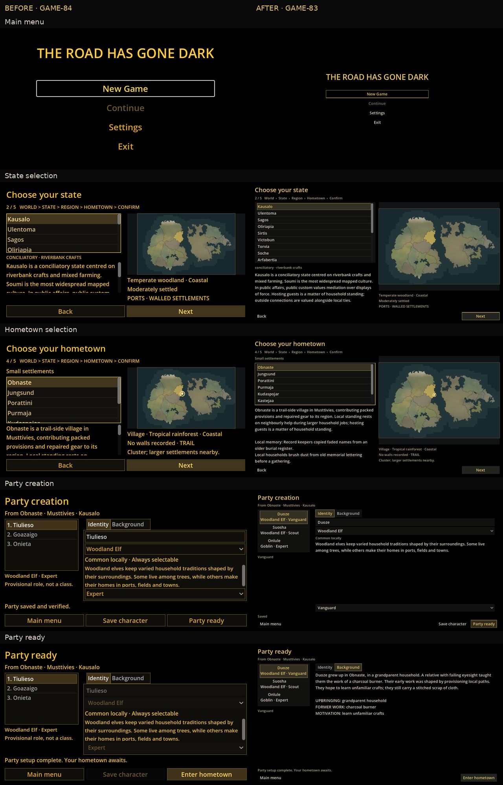
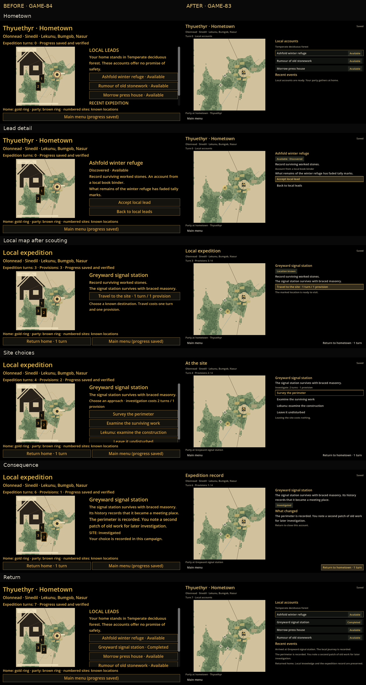

# Actual Godot before/after review

Baseline GAME-84 and GAME-83 were rendered with Godot 4.6.3 on Linux software GL. The sheets resize and arrange original captures only. Names/backgrounds in origin-created parties can differ because each actual New Game creates an independent save. Expedition comparisons use copies of the same prior campaign fixtures and the same action sequence.

| Screen | 640×360 after | 1280×720 after | 2560×1440 after |
| --- | --- | --- | --- |
| Main menu | [Original](after/origin/main-menu-640x360.png) | [Original](after/origin/main-menu-1280x720.png) | [Original](after/origin/main-menu-2560x1440.png) |
| State selection | [Original](after/origin/state-640x360.png) | [Original](after/origin/state-1280x720.png) | [Original](after/origin/state-2560x1440.png) |
| Hometown selection | [Original](after/origin/hometown-choice-640x360.png) | [Original](after/origin/hometown-choice-1280x720.png) | [Original](after/origin/hometown-choice-2560x1440.png) |
| Party creation | [Original](after/origin/party-creation-640x360.png) | [Original](after/origin/party-creation-1280x720.png) | [Original](after/origin/party-creation-2560x1440.png) |
| Party ready | [Original](after/origin/party-ready-640x360.png) | [Original](after/origin/party-ready-1280x720.png) | [Original](after/origin/party-ready-2560x1440.png) |

| Screen | 640×360 after | 1280×720 after | 2560×1440 after |
| --- | --- | --- | --- |
| Hometown | [Original](after/expedition/hometown-640x360.png) | [Original](after/expedition/hometown-1280x720.png) | [Original](after/expedition/hometown-2560x1440.png) |
| Lead detail | [Original](after/expedition/lead-640x360.png) | [Original](after/expedition/lead-1280x720.png) | [Original](after/expedition/lead-2560x1440.png) |
| Local map after scouting | [Original](after/expedition/rumour-discovered-640x360.png) | [Original](after/expedition/rumour-discovered-1280x720.png) | [Original](after/expedition/rumour-discovered-2560x1440.png) |
| Site choices | [Original](after/expedition/site-options-640x360.png) | [Original](after/expedition/site-options-1280x720.png) | [Original](after/expedition/site-options-2560x1440.png) |
| Consequence | [Original](after/expedition/consequence-640x360.png) | [Original](after/expedition/consequence-1280x720.png) | [Original](after/expedition/consequence-2560x1440.png) |
| Return | [Original](after/expedition/returned-hometown-640x360.png) | [Original](after/expedition/returned-hometown-1280x720.png) | [Original](after/expedition/returned-hometown-2560x1440.png) |

[All baseline captures](before/) · [All final captures](after/)

Filenames identify physical window sizes. The responsive 1280×720 window has a 1280×719 rendered viewport due to integer logical-canvas rounding; the original texture is preserved without padding. Exact raster dimensions and hashes are recorded in review-proof.json.

Windows native execution and laptop visual review are distinct; use the complete build for the latter.
