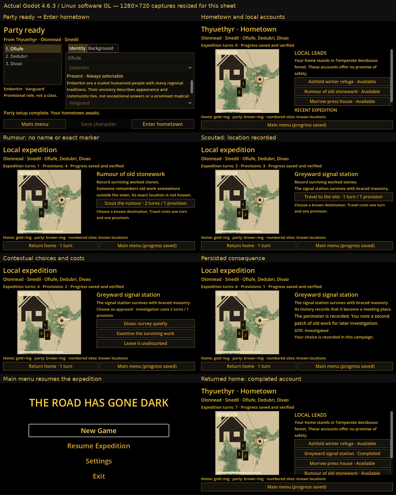
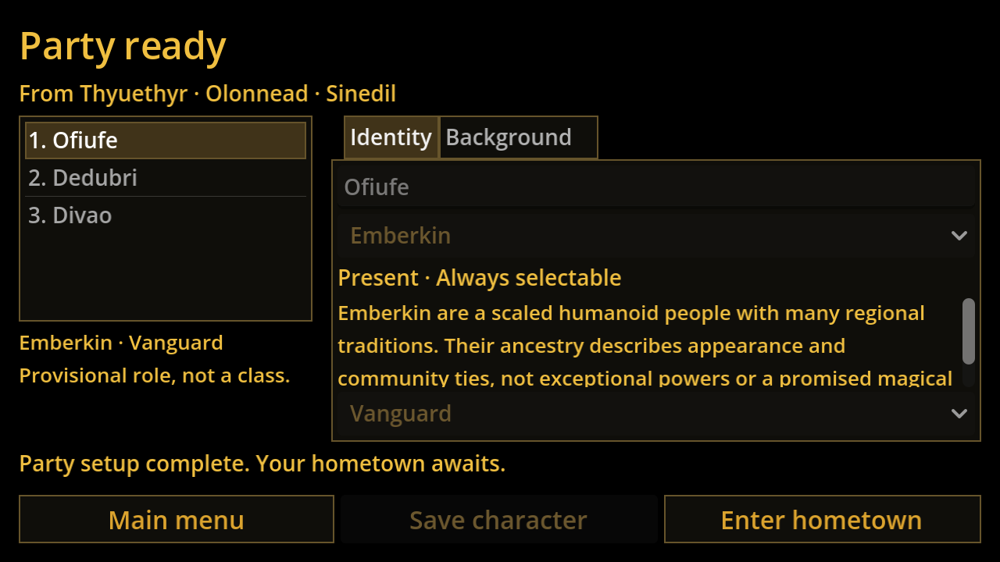
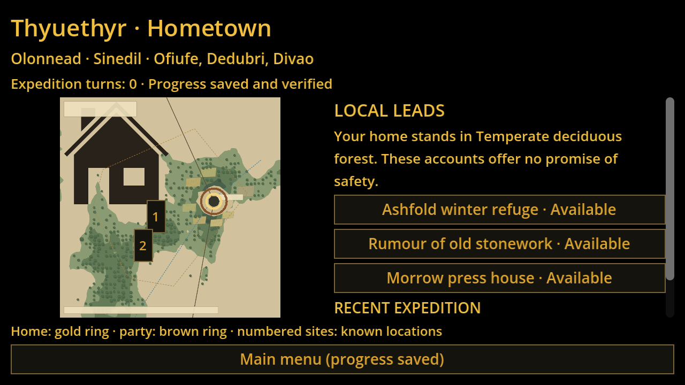
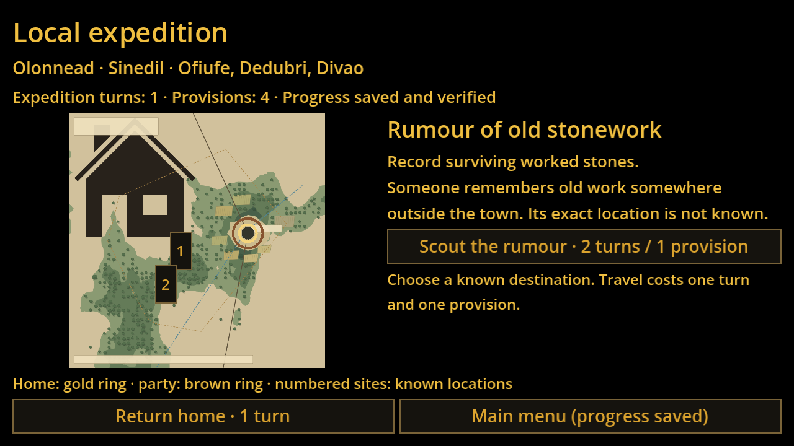
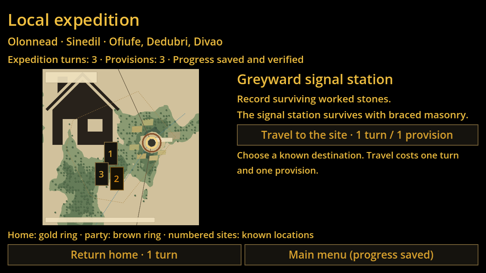
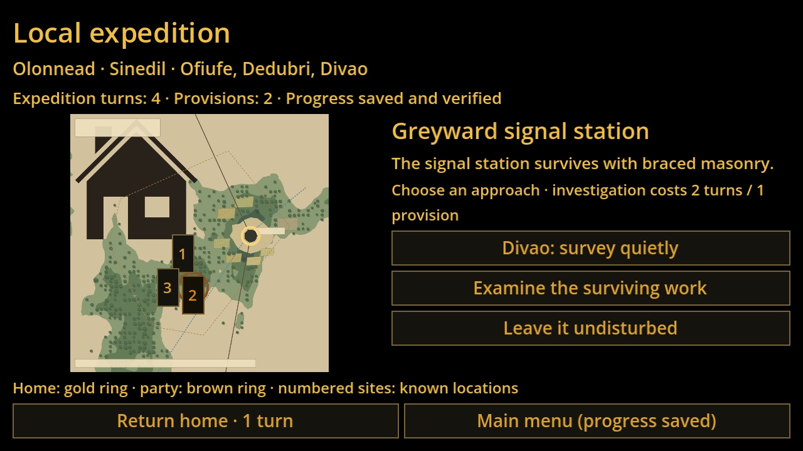
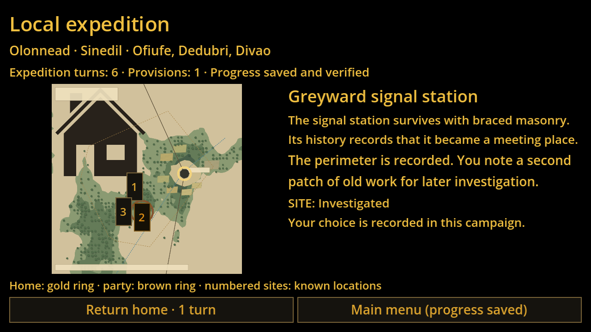
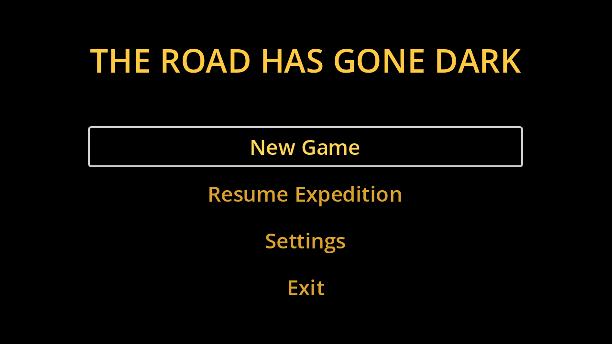
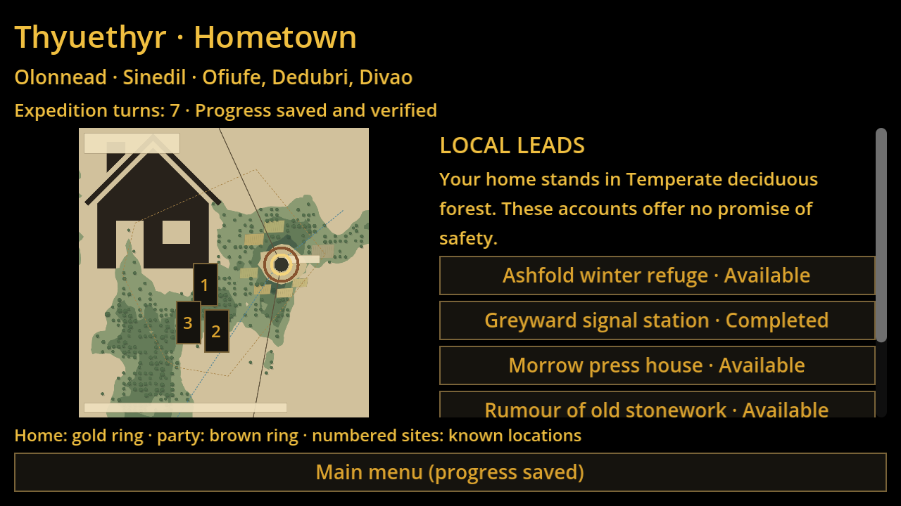

# Actual Godot screenshot sequence

Linux Godot 4.6.3, Mesa software GL; native Windows execution is verified separately in CI and awaits Mark’s laptop visual acceptance. Images are genuine game renders. The contact sheet only resizes/composes them; original captures remain below.

## Party ready → Enter hometown

## Hometown and local accounts

## Rumour: no name or exact marker

## Scouted: location recorded

## Contextual choices and costs

## Persisted consequence

## Main menu resumes the expedition

## Returned home: completed account

## Other resolutions and fresh source world

[640×360](screenshots/site-options-640x360.png) · [2560×1440](screenshots/site-options-2560x1440.png) · [Fresh generated world](screenshots/fresh-generated-world.png) · [Known location selection](screenshots/known-site-map.png) · [All originals](screenshots/)
