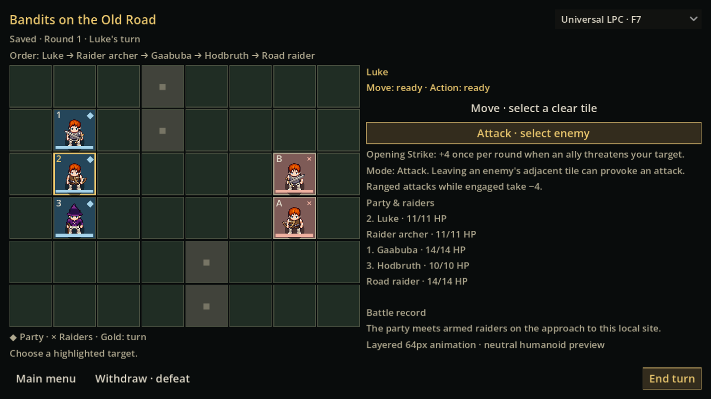
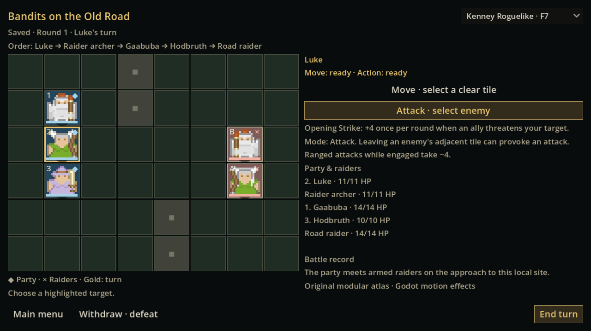
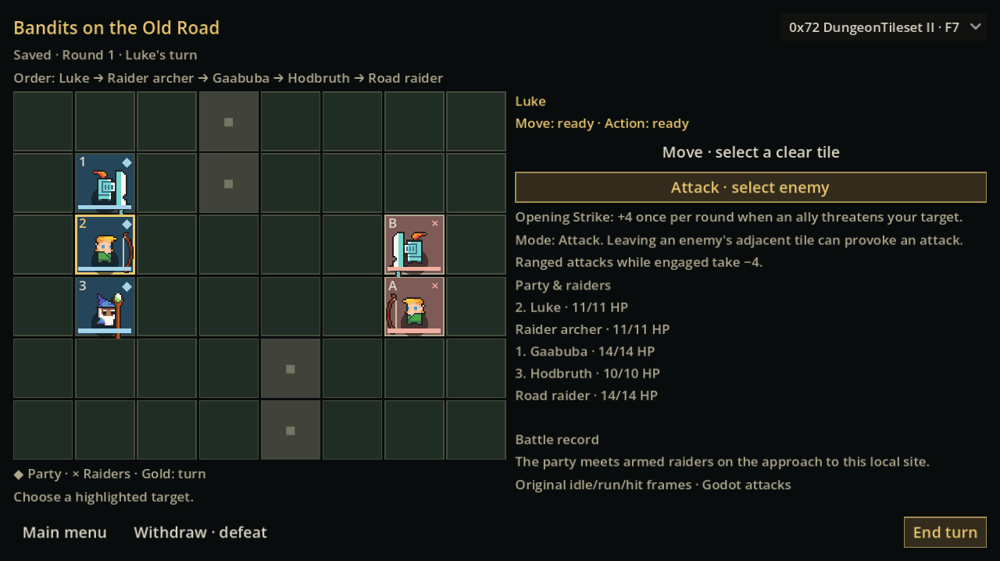
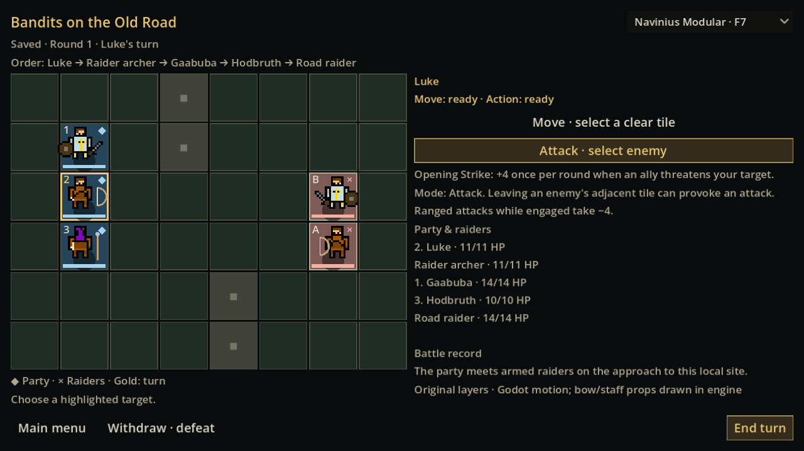

# GAME-93 — Executed validation and visual evidence

Implementation/build source: `1b95971eccab9d811be60851122e21f1012d3a06`. Local tools: official Godot 4.6.3, Node 24.19.0; rendered evidence uses Mesa llvmpipe/X11 on Linux. These are actual Godot viewport captures, not mock-ups. Native Windows package evidence is recorded in [BUILD.md](BUILD.md).

## Executed source checks

| Check | Result | Evidence |
| --- | --- | --- |
| Four providers, original source integrity | 481 original resource SHA-256 values verified | [Manifest](../../../data/art/sources.json), [provider log](evidence/art-providers.log) |
| Deterministic recipes, identity, equipment, neutral anatomy fallback, raider roles and cross-style combat equivalence | 273 assertions, zero failures | [Provider proof](evidence/art-providers.json) |
| Presentation preference after application restart | Write/read in two fresh Godot processes passed | [Write](evidence/art-preference-write.log), [restart](evidence/art-preference-restart.log) |
| Existing First Adventure combat and campaign create/reload | 67 + 20 + 86 = 173 checks passed | [Combat](evidence/adventure-combat.log), [create](evidence/adventure-campaign-create.log), [reload](evidence/adventure-campaign-reload.log) |
| Existing rendered First Adventure interaction regression | 43 checks passed | [Rendered input](evidence/adventure-visual.log), [timings](evidence/adventure-results.json) |
| GAME-32 deterministic kernel and migrations | 22,181 + 235 + 6 = 22,422 checks passed | [Kernel](evidence/rules-kernel-results.json), [migration](evidence/rules-migration-create.json), [restart](evidence/rules-migration-reload.json), [timings](evidence/rules-run-timings.json) |
| GAME-83 production presentation contract | 20 checks, zero failures | [Presentation](evidence/game83-presentation.log) |
| Full generated-world journey and four-style rendered comparison | 899 checks, zero failures | [Review proof](evidence/linux-review-proof.json), [raw log](evidence/linux-review.log) |
| Native Windows exported-package journey with empty PATH and bundled helper | 237 checks, zero failures; production launch and separate-process preference passed | [Windows proof](evidence/windows-proof.json), [raw log](evidence/windows-native.log), [launch](evidence/windows-production-launch.log) |
| Downloaded Windows distribution | ZIP SHA/CRCs, AMD64 game/Node, 481 original art hashes, production hash and no QA executable verified | [Archive audit](evidence/downloaded-archive-audit.json), [checksum](evidence/windows-build.sha256) |

The same First Adventure (173), art (273 plus separate-process preference), GAME-32 (22,422) and GAME-83 (20) regressions passed on the native Windows runner. Windows source test logs/proofs/timings are retained with the `windows-adventure-`, `windows-art-` and `windows-rules-` prefixes; the complete workflow and downloadable evidence are linked in BUILD.md. Native and Linux campaigns have different generated character IDs, but the frozen provider combat test hashes agree across all four styles and both platforms.

The provider suite resolves the same 40-command test stream under each style and includes state, log and RNG in the compared hash. Every style produced `63763c2fd9326b8a36159e83f7d077ac96c5eb2829c4efa9eec7c55228306732`. The rendered review snapshots the entire battle before switching and checks canonical equality after selector/F7 interactions and rejected missing-resource selection. It checks all five stable identity recipes and restores the same recipes after menu/save reload. All 48 actual tile bounds are checked at each target resolution; the independent rendered-input regression and full journey issue movement/targeting clicks through the real production controls.

The full journey generates a fresh world using `first-adventure-review-v1`; its source SHA is `597c79854050cd9268d24fbef6345b3d7f90666fe5d8f3c2cac6afe60443f099`. Three existing generated companions are configured through the existing party editor as Vanguard, Scout and Adept for the comparison. Each new campaign has its own persistent IDs; appearances stay stable within the saved campaign. This does not replace or regenerate the player's companions.

The journey covers world → origin → hometown → party → preparation → lead → departure → scouting/travel → site → combat → menu/save resume → victory → regional results → return home/history. An isolated campaign fork additionally exercises the explicit withdrawal/defeat → results → home route. The existing combat suite also tests defeat. Victory gives the existing 10-XP placeholder/history; defeat gives no victory reward. No consequence rules were changed.

## Comparable screenshots

All twelve captures below show the same saved five-unit encounter, turn, HP, positions and combat log. The stored battle hash is `a5d1ceafab4648538c67cd954196864d49ab7cf2993fae541d81d01703bf6678`. The differing sprite pixels are presentation only.

| Genuine provider | 640×360 | 1280×720 | 2560×1440 |
| --- | --- | --- | --- |
| Universal LPC | [Small](evidence/art-lpc-640x360.png) | [Review](evidence/art-lpc-1280x720.png) | [Large](evidence/art-lpc-2560x1440.png) |
| Kenney Roguelike | [Small](evidence/art-kenney-640x360.png) | [Review](evidence/art-kenney-1280x720.png) | [Large](evidence/art-kenney-2560x1440.png) |
| 0x72 DungeonTileset II | [Small](evidence/art-0x72-640x360.png) | [Review](evidence/art-0x72-1280x720.png) | [Large](evidence/art-0x72-2560x1440.png) |
| Navinius Modular | [Small](evidence/art-navinius-640x360.png) | [Review](evidence/art-navinius-1280x720.png) | [Large](evidence/art-navinius-2560x1440.png) |






Other player-path captures: [party](evidence/party.png), [prepared](evidence/party-prepared.png), [expedition](evidence/expedition.png), [site](evidence/site.png), [victory](evidence/victory.png), [results](evidence/results.png), [home/history](evidence/returned-home.png), [defeat](evidence/defeat.png), [defeat results](evidence/defeat-results.png).

Short captures from the actual Godot renders: [movement](evidence/movement-capture.gif), [attack/spell](evidence/attack-capture.gif). Eight original PNG frames for each capture are retained beside these GIFs. GIF playback is set to 20 FPS for inspection; it is not a wall-clock performance benchmark. These captures demonstrate Godot effects using Navinius, not original Navinius walk/spell animation frames.

## Reproduce locally

Use the pinned matching offline helper and the project's normal writable Godot user directories. From the repository:

```sh
python3 tests/art/run-tests.py --output /tmp/game93-art-check
python3 tests/adventure/run-tests.py --visual --work-dir /tmp/game93-adventure-check
ADVENTURE_REVIEW_ROOT=/tmp/game93-review-check xvfb-run -a godot --audio-driver Dummy --path . tests/adventure/review-flow.tscn
```

Linux rendered tests require Xvfb, xauth, xdotool and libxdo. The native selector is a separate Godot window, so the review driver sends real X11 keyboard events to that popup. Headless Windows QA uses the selector signal and normal F7 input; native popup mouse/keyboard/GPU feel remains a human review step. Use a fresh output directory each time. Source helper overrides are allowed only for source checks; the Windows package diagnostic removes those overrides and clears PATH.

## Diagnosed validation issues

Earlier source runs exposed footer overflow at 640×360 and a test-driver assumption that native popup windows accepted synthetic viewport key events. The layout budget was corrected; popup QA now sends real native events. Screenshot inspection also caught an incorrect Kenney axe/empty staff atlas selection; final captures use verified original bow, sword, wizard robe/hat and staff cells. The final source run completed with zero failures. These diagnoses do not constitute four-pack acquisition blockers.

Known limits: the spike supplies neutral humanoid previews rather than complete ancestry coverage; 640×360 remains compact; Navinius needs original bow/staff artwork for a fully authored equipment set; native Windows desktop/GPU and subjective combat feel still require human playtest. See [README.md](README.md) for each provider's animation/customisation limits and comparative recommendation.
