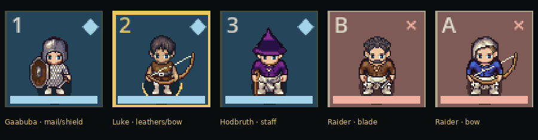

# GAME-94 — Universal LPC Character Presentation V1

LPC is the sole production character provider. This continues the reviewed PR #72 head `e02e22dca1d9e20a75c9a087d9e8565d44ecca01`; [audit and scoped plan](AUDIT.md) records the starting problems and reuse decisions. Draft [PR #73](https://github.com/marksprietsma-beep/road-has-gone-dark/pull/73) targets PR #72's `feature/game-93-four-sprite-styles`, which depends on PR #71. Review this delta separately, integrate the parent drafts deliberately, then retarget; none has been merged automatically.

## What changed

The existing `CombatArt`/`CombatPawn`/First Adventure controller remain the rendering path. Original LPC artwork now supplies two compatible body families, three heads, three hair shapes, facial hair, actual chainmail/leather/shields, coordinated traveller/caster clothing, hats/helmets and rough capes/hoods. A small blade represents the actual `shortblade`; bows have paired foreground/background layers and staff users have cane/thrust layers. The selected tunic/skirt combination supports staff attacks in both body families; the upstream full robe lacks those frames and was rejected for that recipe.

Choices use independent SHA-256 domains from persistent IDs and an existing separate visual seed. Wardrobe follows mechanical equipment rather than ancestry names or arbitrary class colours. The Vanguard owns mail/shield, the Scout owns leathers/bow, and the Adept owns staff/focus-token. Authored raiders own only their blade or bow and receive rough clothing rather than invented party armour. Re-entering a scene or changing equipment does not reroll the body/head/hair choices. Skin/hair adjustments are authored presentation, applied once per cached texture; original PNG bytes remain unchanged.

A shared timeline drives all native layers. North/west/south/east use authentic source rows; equipment is never mirrored. Walking interpolates along the resolved legal route with facing per segment. Blade attacks use slash, bows use shoot with timed projectile travel, staves use thrust, and magic uses spellcast. Brief native hurt reactions supplement damage flashes/text/HP changes; misses, blocked damage and resisted damage have distinct labels. Defeated units freeze the last native hurt frame and display DOWN. Reusing pawns across harmless refreshes preserves ongoing movement/idle phase. Serial cancellation and bounded HP settling prevent interrupted visuals from leaving stale health or poses.

These are consequences of committed commands. No battle commands, damage, dice, RNG, action economy, diagonal rules, saved battle, campaign consequences, world generation or 8×6 geometry changed. The frozen GAME-93 40-command battle/log/RNG hash remains `63763c2fd9326b8a36159e83f7d077ac96c5eb2829c4efa9eec7c55228306732`.

The four-style selector and F7 cycling are retired. An old non-LPC `presentation.cfg` resolves safely to LPC. GAME-93 research, source manifest, artwork and review evidence remain in repository/history; its original runtime catalog is archived in `../game93/style-catalog.json`. Windows exports exclude Kenney, 0x72 and Navinius from both embedded resources and the external artwork folder.

## Identity and future bodies

The accepted [GAME-88 guide](https://github.com/marksprietsma-beep/road-has-gone-dark/blob/research/game-88-dnd35-character-options/docs/design/character-identity-build-life-direction.md) was read. Prototype peoples, including Emberkin, and guide examples are not an approved final ancestry list. None selects a sprite recipe.

Profiles retain ancestry reference, heritage, culture, origin/background, equipment and acquired/transformed layers separately. Body descriptors retain plan, size, proportions, surface, named parts and optional features. Replacement LPC body recipes and validated optional overlays can be supplied without replacing combat authority or rewriting this renderer. Unsupported anatomy/features receive an explicit neutral preview warning; a mutation need not overwrite ancestry or class history.

The shipped art covers two humanlike illustration families, not character sex mechanics or all ancestries. Sizes/proportions are bounded presentation adjustments, not changes to grid occupancy or combat reach. More unusual heads, small/large bodies, tails/wings, prosthetics and transformations require appropriate future artwork. No such gameplay or final ancestry mechanics were added.

## Evidence

All images originate from actual Godot viewport renders. Closeups are nearest-neighbour enlargements of those pixels, not generated or retouched artwork.

| Same saved identities and encounter | Before PR #72 | After GAME-94 |
| --- | --- | --- |
| 640×360 | [Before](evidence/before-640x360.png) | [After](evidence/after-640x360.png) |
| 1280×720 | [Before](evidence/before-1280x720.png) | [After](evidence/after-1280x720.png) |
| 2560×1440 | [Before](evidence/before-2560x1440.png) | [After](evidence/after-2560x1440.png) |



The copied, generated Gaabuba/Luke/Hodbruth party in `tests/lpc/generated-party.json` comes from the GAME-93 review save. HP is restored only in this isolated comparison fixture. Both baseline and revised encounter produce initial hash `8ceb714a7c8fd390e23c3ef1a149ba1cd0f67b0d6d9d3bd96a9a02bbc6b11244` with identical identities/equipment/board. The live test invokes actual `TacticalCombat.command` results and the production controller's `animate_committed`; it never writes campaign saves.

Animation cases use separately documented controlled positions/cursors and diagnostic seeds to guarantee a legal hit/miss/downing. The defeat target starts at 1 HP only in that diagnostic fixture. Actual gameplay still rolls and resolves normally. [Raw animation proof](evidence/lpc-proof.json) retains every command, before/after hash, native frame indices, facing, travel, feedback and health samples. GIFs preserve the captured frame timing approximately, resampled to 20 fps.

| Animation | Running-game capture |
| --- | --- |
| Native walking and route interpolation | [Movement](evidence/movement.gif) |
| Wind-up/slash/lunge/impact/recovery and damage | [Melee](evidence/melee.gif) |
| Draw/release/projectile/hit | [Ranged](evidence/ranged.gif) |
| Native staff thrust | [Staff](evidence/staff.gif) |
| Native casting, restrained Lantern Spark and hit | [Magic](evidence/spell.gif) |
| Resolved miss with distinct feedback | [Miss](evidence/miss.gif) |
| Hurt sequence and frozen defeated state | [Defeat](evidence/defeat.gif) |

The separate generated-world walkthrough uses production controllers, input and saving: New Game → generated world → origin/hometown → party → preparation → lead → expedition/site → battle → victory → region/home; Main menu/Resume restores the exact saved battle and recipes. A cloned diagnostic campaign also withdraws, returns home and retains failure history without victory XP. [Party](evidence/journey-party.png), [expedition](evidence/journey-expedition.png), [results](evidence/journey-results.png), [returned home](evidence/journey-returned-home.png), [defeat results](evidence/journey-defeat-results.png).

## Validation

| Check | Result |
| --- | --- |
| First Adventure combat/campaign create/restart | 67 + 20 + 86 assertions, all passed |
| Existing rendered combat controls | 43 passed |
| GAME-32 frozen rules/oracle and real migration/restart | 22,181 + 235 + 6 passed |
| GAME-83 presentation | 20 passed |
| Original LPC resources / per-item attribution | 291 original hashes verified |
| LPC recipes/native geometry/equipment/persistence/frozen combat hash | 938 passed; separate-process legacy preference fallback passed |
| Live production-scene animation, responsive geometry, credits, cancellation and save/reload | 497 rendered assertions; seven resolved-command cases, all passed |
| Full rendered generated-world journey | 353 passed, both return paths passed |

[Timing records](evidence/adventure-timings.json), [rules log](evidence/rules.log), [UI log](evidence/ui.log), [appearance proof](evidence/art-proof.json), [render log](evidence/lpc-render.log), [journey proof](evidence/journey-proof.json), [journey log](evidence/journey.log). Native Windows proof and download details are recorded in [DELIVERY.md](DELIVERY.md) after packaging finishes.

Reproduce from this branch with Godot 4.6.3, Node 24.19.0 and the existing compatible offline helper:

```sh
python tests/adventure/run-tests.py --visual --work-dir /tmp/game94-adventure
GAME32_EVIDENCE=/tmp/game94-rules python tests/rules/run-tests.py
godot --headless --audio-driver Dummy --path . --script tests/ui_system/presentation.gd
python tests/art/run-tests.py --output /tmp/game94-art
GAME94_LPC_ROOT=/tmp/game94-render xvfb-run -a godot --audio-driver Dummy --path . --script tests/lpc/review.gd
GAME76_HELPER_ROOT="$PWD/worldgen-helper" ADVENTURE_REVIEW_ROOT=/tmp/game94-journey xvfb-run -a godot --audio-driver Dummy --path . tests/adventure/review-flow.tscn
```

Use fresh output directories. Native Windows CI additionally exports the real executable, launches the production program and an isolated diagnostic from the packaged resources, clears PATH/Node options, removes the source-helper override, exercises actual world generation/save/resume/both outcomes, verifies all source hashes and excludes retired provider resources. Godot/Node are build dependencies; players need neither installed.

## Attribution and limits

Source: [Universal LPC](https://github.com/LiberatedPixelCup/Universal-LPC-Spritesheet-Character-Generator), revision `58ce1aa479e4df32845a73a5d0afc221c3a893c2`. `data/art/lpc-sources.json` records exact URLs, revisions, unchanged SHA-256 values, authors and per-item selected licences. Original metadata plus full upstream CREDITS.csv/README and repository GPL notice are retained. No upstream generator implementation code was copied. Selected artwork uses OGA-BY 3.0 where offered and CC-BY-SA 3.0 otherwise; palette/composition adaptations are distributed under CC-BY-SA 3.0. Windows includes originals, manifest, credits and legal notices in `artwork/`, with discoverable scrolling credits in combat.

This is a convincing V1, not a final animation catalogue. Clothing without native idle holds its matching walk pose while supported body/hair/armour layers idle. Bow idle holds its aligned walking pose; staff is stowed while casting, and shield/cane layers without hurt are omitted when downed. No unsupported animation is described as native: interpolation, projectile traces, lunge, ring, flash and floating text are Godot effects. Idle motion is intentionally slight. The focus-token has no separate sprite accessory in this subset. Minor inherited hand/cloth seams and mixed source silhouettes may remain, particularly at 640×360; future authored art should refine these.

Linux evidence uses actual Godot/Mesa rendering. Native Windows automation verifies packaging and gameplay with a headless driver; it does not substitute for human desktop/GPU animation review. The rendered journey and short native production-launch check emit a Godot ObjectDB cleanup warning at exit (also present in PR #72); no script errors or failed gameplay checks were observed. GAME-95 battlemap size/environment, final ancestry artwork, equipment progression and the later combined lighting/visual polish pass remain separate work.
