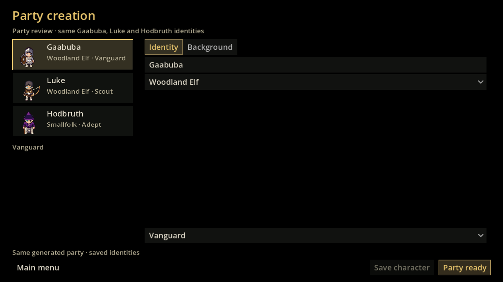
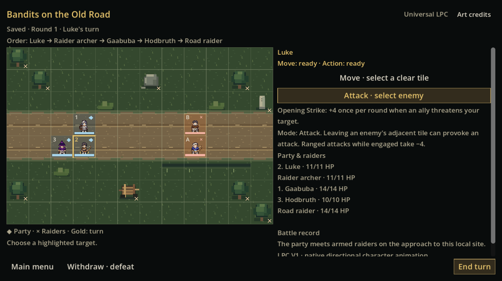

# GAME-95 — Party previews, readable combat and the Old Road

Continues delivered GAME-94 (`3c3343fd14282397c46932417f519df7b526ea40`, tested game `c4a5b7c7b55aaffff568e940c04ca9bf75eee61f`). [Audit before implementation](AUDIT.md) records the reuse decisions and geometry tradeoff. This is a review branch stacked on draft #73; drafts #71–#73 remain unmerged. The uploaded GAME-95 handoff is authoritative.

## What changed

Party Creation shows three compact static LPC paper dolls alongside each adventurer's name, people and provisional calling. The existing identity/background tabs and editing actions remain. `PartyRoster` replaces only the native list widget because Godot's left-icon ItemList ignores multiline captions. Mouse selection, arrow navigation and busy-state disabling are retained.

The preview calls existing GAME-32 preparation on a local ready copy, or uses already-prepared records. It never commits draft mechanics. `CombatArt.recipe`, source-frame extraction, original textures and palette cache are shared with combat. Persistent IDs choose the same body/head/hair/clothing and actual starting equipment; the icon uses front-facing idle frame zero. Preview refresh does not consume dice or rewrite identities. This does not add an appearance editor, ancestry mechanics or a final ancestry roster.

Movement now installs the previous-tile offset synchronously before the committed destination can draw. Native walk frames and interpolation visibly cover each tile. A bounded presentation pause prevents the next command/AI turn from cancelling unfinished actions. Buttons unlock in place at the end of the beat, preserving focus and controls rather than rebuilding them. Authority still resolves and saves first; animation observes that committed result. Menu/Escape can leave the saved encounter during a visual beat, and resume starts without a stale wait.

| Presentation setting | GAME-94 | GAME-95 |
| --- | --- | --- |
| Travel per tile | 0.18 s | 0.30 s |
| Arrow/spell travel | 0.40 s | 0.55 s |
| Melee impact | 0.34 s | 0.44 s |
| Bow release | 0.58 s | 0.76 s |
| Spell release | 0.46 s | 0.60 s |
| Following actor | Fixed AI pause, cancellable visuals | Computed beat + 0.22 s recovery spacing; AI adds 0.32 s |
| Upper bound for command presentation | No shared bound | 3.2 s |

`CombatPacing` holds the small FPS/impact/reaction/feedback constants. Blade anticipation/lunge, native attacks/casts, arrow outline/travel, delayed HP reaction, floating damage/miss/resistance and deliberate native down frames make the sequence readable. LPC supplies character frames; projectile, lunge, flash, travel and feedback are Godot effects. No speed-settings framework was added.

## Authored map and registered dimensions

Newly begun production encounters explicitly request **12×8**. The original 8×6 file remains byte-for-byte intact. `CombatBattlefields.PATHS` registers exactly three immutable mechanical definitions:

| Registry ID | Definition | Purpose |
| --- | --- | --- |
| `legacy-8x6-v1` | `data/combat/first-road-encounter.json` | Existing saves, frozen replay and backwards-compatible default for old callers |
| `old-road-10x8-v1` | `data/combat/battlefields/old-road-10x8-v1.json` | Supported, tested nearby size; no player-facing size menu |
| `old-road-12x8-v1` | `data/combat/battlefields/old-road-12x8-v1.json` | New outdoor encounter default |

Each definition retains the canonical `first-road-v1` identity, title, width/height, blocked cells, three party positions and two authored enemy records/spawns. Existing battle saves already contain the definition and its source SHA. Validation recognizes the exact registered board/SHA pair, rejects altered pins, and never migrates an old board to a larger one. Unknown sizes/layouts cannot create a battle.

`old-road-presentation-v1.json` supplies an authored ground matrix and feature placements per layout. Original project-authored 32-pixel terrain drawings in `BattlefieldTile` render the worn two-track dirt road, broken verge, grass/scrub, trees, rock, shallow ditch, milestone and broken cart beneath transparent tactical overlays. Coordinate hashes vary small texture flecks only; they do not generate terrain or use combat RNG. There is no new external terrain pack or licence dependency. The Windows distribution includes `OLD-ROAD-ART-NOTICE.txt`; original LPC per-part sources/licences/credits remain unchanged in `artwork/`.

Blocking comes only from the mechanical board, indicated by a lower-right cross. Road, scrub and shallow ditch are ordinary walkable ground: no new terrain costs/cover/attack rules. Party diamonds, raider crosses, active gold borders, HP bars, target washes and movement dots remain distinct from the terrain. Renderer columns, tile pitch and height budget follow the saved dimensions. The fixed authored approach is tied to the current saved site and hometown context where available; it does not pretend to reconstruct the generated site's exact geography or biome.

## Evidence and deterministic integrity

All screenshots/GIF frames originate from actual production Godot viewport renders on Linux/Mesa. GIFs retain measured capture intervals rounded to 10 ms; they are not fabricated artwork. The controlled animation rig uses the real command resolver, diagnostic seeds/positions and one 1-HP target to show a legal downing. It never writes these fixtures into a player campaign. Raw command hashes, elapsed times, source frames, facing, travel, feedback and HP are retained in [game95-proof.json](evidence/game95-proof.json).

| Resolution | Party before | Party after | New Old Road |
| --- | --- | --- | --- |
| 640×360 | [Before](evidence/party-before-640x360.png) | [After](evidence/party-after-640x360.png) | [12×8](evidence/old-road-12x8-v1-640x360.png) |
| 1280×720 | [Before](evidence/party-before-1280x720.png) | [After](evidence/party-after-1280x720.png) | [12×8](evidence/old-road-12x8-v1-1280x720.png) |
| 2560×1440 | [Before](evidence/party-before-2560x1440.png) | [After](evidence/party-after-2560x1440.png) | [12×8](evidence/old-road-12x8-v1-2560x1440.png) |

The before/after party comparison uses the same generated Gaabuba/Luke/Hodbruth identities from the existing review fixture. Additional evidence includes all three registered maps at all three resolutions. The full fresh-world walkthrough separately proves real draft-party previews match later combat, legacy save/command/menu resume, new 12×8 combat, victory/defeat and return-home history.




| Beat | Actual rendered capture |
| --- | --- |
| Walking tile-by-tile | [Movement](evidence/movement.gif) |
| Anticipation/slash/hit | [Melee](evidence/melee.gif) |
| Bow release/projectile/hit | [Ranged](evidence/ranged.gif) |
| Staff thrust | [Staff](evidence/staff.gif) |
| Casting/projectile/damage | [Spell](evidence/spell.gif) |
| Miss feedback | [Miss](evidence/miss.gif) |
| Delayed hit/native down transition | [Defeat](evidence/defeat.gif) |

The previous [GAME-94 movement capture](../game94/evidence/movement.gif) provides the before-timing reference. [Legacy timing proof](evidence/legacy-lpc-proof.json) retains identical legacy initial/command hashes while changing presentation only. New map captures necessarily use the larger geometry.

Deterministic equivalence is defined **for the same mechanical layout and commands**. The test-only GAME-94 combat snapshot is pinned to `c4a5b7c...`, verified against its recorded SHA, and differs only in its class name. For every registered layout, the new implementation's AI decisions and complete command results, states/logs/RNG/budgets match this independent frozen authority, through a completed encounter. Every intermediate state validates after JSON reload. The original legacy frozen battle/log/RNG hash stays `63763c2fd9326b8a36159e83f7d077ac96c5eb2829c4efa9eec7c55228306732`; the original comparison initial hash stays `8ceb714a7c8fd390e23c3ef1a149ba1cd0f67b0d6d9d3bd96a9a02bbc6b11244`.

Changing board geometry can change paths, AI sequences and outcomes. Larger maps do not promise the same outcome as the smaller board. No action economy, diagonal/melee legality, attacks/damage, classes, dice or world generation was changed. There is no second save writer.

## Reproduce and review

Use pinned Godot 4.6.3 and the existing compatible helper. Generated evidence/test profiles belong outside the repository/player save directory:

```sh
python tests/adventure/run-tests.py --visual --work-dir /tmp/game95-adventure
GAME32_EVIDENCE=/tmp/game95-rules python tests/rules/run-tests.py
python tests/art/run-tests.py --output /tmp/game95-art
godot --headless --audio-driver Dummy --path . --script tests/ui_system/presentation.gd
GAME95_REVIEW_ROOT=/tmp/game95-render xvfb-run -a godot --audio-driver Dummy --path . --script tests/battlefields/review.gd
GAME94_LPC_ROOT=/tmp/game95-legacy godot --headless --audio-driver Dummy --path . --script tests/lpc/review.gd
GAME76_HELPER_ROOT="$PWD/worldgen-helper" ADVENTURE_REVIEW_ROOT=/tmp/game95-journey xvfb-run -a godot --audio-driver Dummy --path . tests/adventure/review-flow.tscn
```

In the editor, open `scenes/ui/main_menu.tscn` (or run the normal project and skip the intro with Escape). Follow **New Game → generate/select world → state → region → hometown → Confirm origin**. Inspect all three preview rows in Party Creation, select with mouse/arrows, edit a name/role through existing controls and save. **Party ready → Enter hometown → Prepare first adventure → local account → Accept → Begin expedition → Scout if necessary → Travel → Fight**. For the demonstrated roles choose Vanguard, Scout and Adept in the existing party editor.

During combat, use **Move** then a dotted tile; **Attack/ability** then a highlighted target; **End turn**. Watch tile travel, anticipation, release, damage/miss and defeat before controls unlock. Use **Main menu → Resume Expedition** both during/after a beat: positions/HP/logs must remain saved. Finish with **Victory or Withdraw → Return to regional play → Return home**; the party history/result persists. F7/style switching remains retired: LPC alone is production art.

See [DELIVERY.md](DELIVERY.md) for the verified Windows artifact, exact extraction/launch instructions, checksum and native evidence. Report screenshots at the selected resolution, actor/action, target, battle log and whether the issue survives menu resume. A human desktop/GPU playtest remains the final readability check.

## Limitations and next step

This is one fixed outdoor approach, not a world-derived procedural map or a new battlefield-family framework. At 640×360, sprites are small and the existing right-hand panel scrolls; the board, status, actions and footer fit. No new animations/art for broader anatomy, transformed bodies or final ancestry coverage were added. Native Windows automated validation uses headless mode; human Windows desktop/GPU and the feel of the new pacing still require review. The unsigned review executable may trigger Windows reputation prompts.

Review the new pacing and map readability before approving anything. If accepted, the next small task can author a second location family using this same registry/render path; no expansion into generation is included here.
