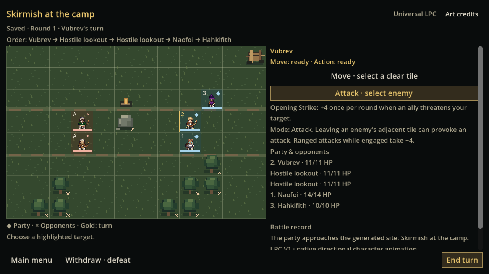
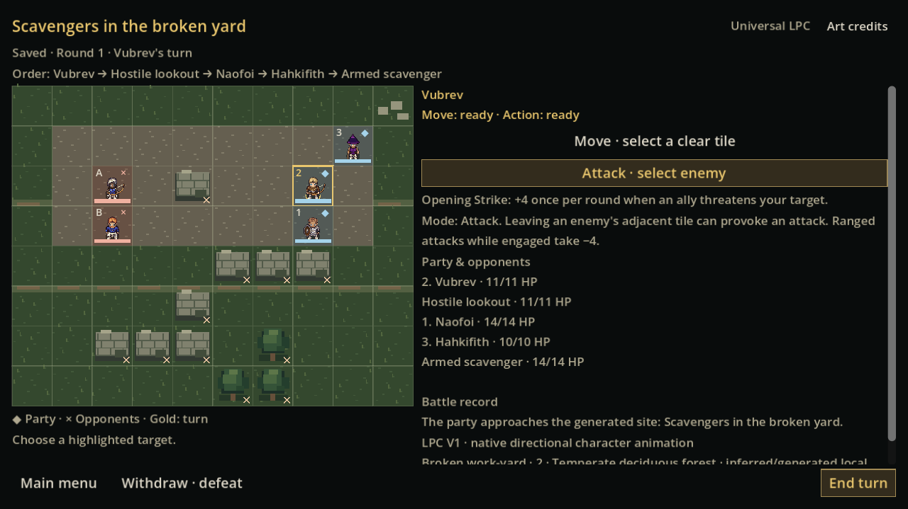
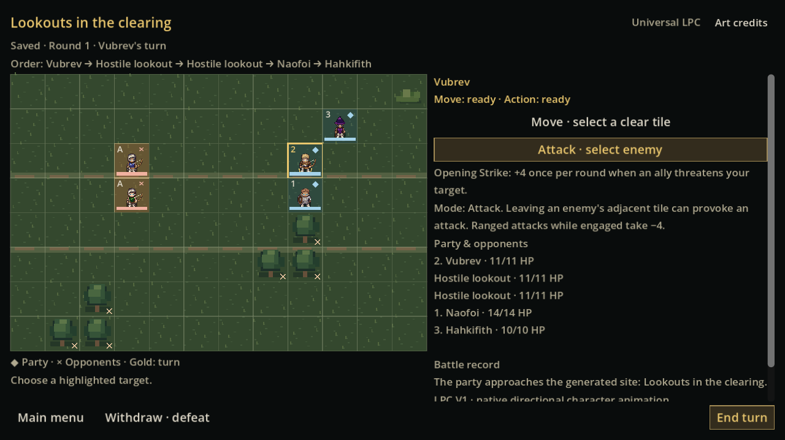

# GAME-96 measured validation

## Actual world corpus

[Raw metrics](evidence/sandbox-metrics.json) and [timings](evidence/sandbox-timings.json) come from five actual Azgaar worlds, including exact byte replay of the two presets and three fresh seeds (`game96-thorn-v1`, `game96-grey-v1`, `game96-ashen-v1`). Forty-five contrasting hometowns include 11 parent biomes and five additional high-elevation contexts. All 360 original GAME-62/84 placements were independently checked against owned dry land; 180 are used by the new four-opportunity bases. No sample/world/hometown was dropped.

| Measurement | Observed |
| --- | ---: |
| Generated opportunities / valid encounters | 180 / 180 |
| Distinct geometry+deployment+composition hashes | 178 |
| Camps / ruined yards / clearings / source-road threats | 58 / 45 / 51 / 26 |
| 8×6 / 10×8 / 12×8 | 54 / 58 / 68 |
| Forest / dry / grass / upland | 124 / 20 / 24 / 12 |
| Single blade / blade+bow / two blades / two bows | 51 / 42 / 40 / 47 |
| Commands checked against frozen GAME94 oracle | 6,925 |
| Validation assertions / failures | 25,111 / 0 |
| Terminal toy-AI wins / losses / stalled | 147 / 33 / 0 |
| Source-corpus rejected candidates / exhausted generators | 0 / 0 |

Every accepted source-corpus map passed on attempt zero. These are actual statistics, not claimed retry coverage. [Separate synthetic constraint fixtures](evidence/generation-constraints.json) exercise three genuinely disconnected composed candidates, exact deterministic acceptance on attempt one after cold regeneration, and an intentionally impossible deployment configuration that exhausts all eight attempts. All 18 assertions pass. These synthetic fixtures are not counted as extra geographic samples or production rejections.

Complete source-world JSON, regional packets, raw logs and timing files are retained in the native CI evidence artifact; the repository keeps readable metrics/proofs/screenshots rather than duplicating 59 MB of source corpus. Replay checks cover unchanged source packet bytes, stable site/opportunity identity, regenerated geometry, literal source-route proximity, valid spawn/connected ground, actual blockers/LOS, all enemy builds, legal commands and JSON reload after every command. The independent frozen resolver receives identical commands and must return the entire same battle/log/RNG.

Before the approach-lane constraint, the diagnostic 40-home run generated 160 maps but three ruin encounters stalled under the old greedy AI; 112 geometric candidates were also rejected. [Original diagnostic output](evidence/diagnostic-pre-fix.log) is retained. The fix changes only terrain composition. The final corpus above reruns all original contexts plus five upland contexts with no stalled encounters. Enemy AI/path/LOS/action algorithms and frozen oracle remain unchanged.

These toy-AI outcomes validate executable mechanics and bounded approach, not final class balance, player fun or a calibrated encounter threat budget. The three-person party versus one/two lightly armed humanoids is deliberately bounded. Conservative lanes reduce enclosure risk but also restrict tactical topology; human playtest should assess flanking, ranged obstruction and variety before introducing harder populations/maps.

## Campaign / regressions

- Separate processes restore exact battle hash, counter/seed, base hash and persistent party IDs, then complete two opportunities and withdraw from a third. Knowledge, final opponents, world deltas, one history/result per opportunity and placeholder reward remain; repeated completed acceptance/commands are rejected. Original journal handles injected write and immediate reload failures with exact-byte rollback. Corrupt generated geometry and self-resealed moved coordinates are rejected; repeat preparation cannot accept coordinate drift. [Final lifecycle evidence](evidence/lifecycle-final-replay.json) includes the latest source-pin guard.
- Existing GAME84/83 authored regional mouse/keyboard walkthrough: 223 checks across all three sizes, including source-map hitboxes, discovery, survey, consequences and return. The historical driver explicitly opts into its fixture and focuses real scroll targets before mouse input; no production behavior/expectation is substituted. [Rendered log](evidence/legacy-region-render.log).
- Existing First Adventure combat: 67 checks; campaign creation/reload: 20/86 checks, frozen golden retained.
- GAME32: 22,181 kernel assertions, deterministic goldens and active-expedition rules migration/restart passed. [Rules proof](evidence/source-rules-results.json).
- GAME83 production presentation: 20 checks. [Log](evidence/source-ui83.log).
- GAME95 registered boards/party-preview/oracle/timing isolation: 3,366 checks, all three registered boards and seven real animation command cases. [Proof](evidence/source-registered-maps.json).
- LPC live presentation: 235 assertions / seven real commands. Original art: all 291 source hashes; provider/preference tests: 938 assertions and separate restart. Historical comparison providers remain excluded from production.

## Actual rendered journey

[Godot proof](evidence/rendered-proof.json): **331 checks, zero failures**, normal Linux/Xvfb/Mesa rendering and actual production controllers. Fresh world generation → origin → a chosen alternate hometown → actual saved party previews → four local opportunities → camp victory → rumoured-yard discovery/victory → clearing withdrawal → home histories. Mouse combat tile targeting, Escape detail navigation, menu/resume, LPC recipe identity and exact battle/RNG preservation during resize are asserted. Native exported Windows tests pass both the procedural journey (294 assertions) and original authored/legacy journey (237 assertions), with empty PATH and bundled dependencies. The native 180-map corpus metrics match Linux exactly. [Native proof](evidence/windows-proof.json) and [package audit](evidence/package-audit.json) retain the evidence.

Three separate generated scenarios, not renamed Old Road maps:

| Scenario | Actual map | Opposition | Result |
| --- | --- | --- | --- |
| Camp | 12×8, grove flanks/fire/cart, central LOS pillar, reversed deployment | Two bows | Victory |
| Broken yard | 10×8, stone yard, broken walls and open approaches | Blade + bow | Victory |
| Clearing | 12×8, separate grove layout/deployment | Two bows | Withdrawal saved as defeat |

At 640×360, 1280×720 and 2560×1440, all tested battlefield/footer/target-feedback bounds fit. Raw PNGs retain the actual Godot viewport texture: 640×360 and 2560×1440 are exact; the requested 1280×720 window yields 1280×719 texture pixels because the inherited responsive canvas rounds its logical reading scale/letterbox. These captures are preserved rather than padded or rescaled. Controls are intentionally compact at 640; desktop human readability still needs review.

Before (registered authored fixture): [GAME95 Old Road](../game95/evidence/old-road-12x8-v1-2560x1440.png). After:

[Camp 2560](evidence/generated-camp-2560x1440.png) · [Yard 2560](evidence/generated-ruins-2560x1440.png) · [Clearing 2560](evidence/generated-clearing-2560x1440.png) · [640 layout](evidence/generated-ruins-640x360.png)

Walkthrough: [Party](evidence/party.png) → [opportunity map](evidence/local-opportunities.png) → [camp site](evidence/site-camp.png) → [camp result](evidence/result-camp.png) → [regional result](evidence/regional-result-camp.png) → [home memory](evidence/returned-home-clearing.png). [Short movement capture](evidence/generated-move.gif) encodes actual Godot frames sampled during a committed move; it is an illustrative snippet, not a timing benchmark or substitute sprite animation.

## Exposed upstream limitation

An additional render trial with `game96-sandbox-review-v2` (SHA `c9eb47dacfe4560df8cdd4bb128ab578ff2997e288c79665fb2cf9ab5791cbe1`) failed before sandbox generation: original helper geography replay reported **Bad Azgaar packed vertex position 9109**. [Exact log](evidence/upstream-geometry-failure.log). This trial is reported separately from the five-world passing corpus, not silently removed from the evidence. Its campaign stayed preserved. Existing world-generator/geography code was not rewritten; a review player hitting this upstream problem should use another world/preset.
