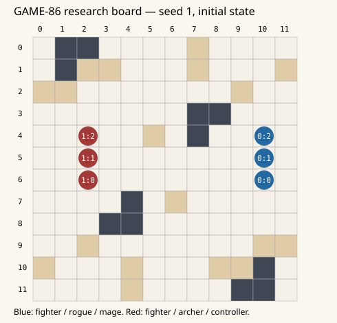

# Actual seeded 3v3 walkthrough

Research diagnostic, not a Godot gameplay capture. This is the original fixed seed1, modelA, moderate12×12 matchup, not a selected showcase win. The raw ordered events and command replay proof are in `research/game86/results/walkthrough.json`.

The board shows the initial state; coordinates increase right/down. Dark gray tiles are walls, tan tiles are cover, blue units are team0 and red units team1.

**Initial order:** 0:2 mage → 1:0 fighter → 1:1 archer → 0:0 fighter → 1:2 controller → 0:1 rogue.

| Round | Actor | Actual command / resolution |
|---|---|---|
| 1 | 0:2 mage | move via [[9, 4], [8, 4], [8, 5], [7, 5]] |
| 1 | 0:2 mage | cast locked tile [2, 5] |
| 1 | 1:0 fighter | dash via [[3, 6], [4, 6], [5, 6], [6, 6], [7, 6]] |
| 1 | 1:1 archer | move via [[2, 6], [2, 7]] |
| 1 | 1:1 archer | attack target 0:2 |
| 1 | 1:1 archer | roll 17, penalty 0, damage 8; 0:2 HP now 16 |
| 1 | 0:0 fighter | charge via [[9, 6], [8, 6]] target 1:0 |
| 1 | 0:0 fighter | roll 13, penalty 0, damage 8; 1:0 HP now 26 |
| 1 | 1:2 controller | move via [[3, 4]] |
| 1 | 1:2 controller | slow target 0:2 |
| 1 | 0:1 rogue | move via [[9, 5], [9, 6], [9, 7], [8, 7], [7, 7]] |
| 1 | 0:1 rogue | attack target 1:0 |
| 1 | 0:1 rogue | roll 15, penalty 0, damage 10; 1:0 HP now 16 |
| 2 | 0:2 mage | burst resolves at [2, 5]; victims [] |
| 2 | 0:2 mage | disengage |
| 2 | 0:2 mage | move via [[8, 5], [9, 5]] |
| 2 | 1:0 fighter | attack target 0:1 |
| 2 | 1:0 fighter | roll 20, penalty 0, damage 12; 0:1 HP now 14 |
| 2 | 1:1 archer | move via [[2, 6]] |
| 2 | 1:1 archer | attack target 0:0 |
| 2 | 1:1 archer | roll 17, penalty 0, damage 8; 0:0 HP now 26 |
| 2 | 0:0 fighter | attack target 1:0 |
| 2 | 0:0 fighter | roll 10, penalty 0, damage 8; 1:0 HP now 8 |
| 2 | 1:2 controller | move via [[4, 4], [5, 4]] |
| 2 | 1:2 controller | slow target 0:1 |
| 2 | 0:1 rogue | attack target 1:0 |
| 2 | 0:1 rogue | roll 9, penalty 0, damage 10; 1:0 HP now 0 |
| 2 | 0:1 rogue | move via [[6, 7], [6, 6], [6, 5]] |

## Remaining rounds

| Round | Attack attempts | Hit damage | Burst damage events | Defeated actors |
|---|---:|---:|---:|---|
| 3 | 3 | 22 | 0 | none |
| 4 | 3 | 24 | 0 | 0:2, 1:2 |
| 5 | 1 | 6 | 0 | none |
| 6 | 1 | 10 | 0 | none |
| 7 | 2 | 8 | 0 | none |
| 8 | 2 | 8 | 0 | 1:1 |

The mage spends a Focus on a tile occupied by clustered enemies. They move before resolution; the burst hits nobody. This is visible counterplay and also potentially poor target selection. Without a paired counterfactual it is not valid to credit the cast with a particular amount of prevented damage.

The fighter charges into the opposing fighter while the rogue reaches an allied-threat position and deals10 damage. That illustrates the toy support condition, not geometric flanking. On round2 the slowed mage spends main on Disengage and moves two tiles; it does not attack for free. The controller spends both Focus on Slow while the opposing team kills its fighter. This trace makes the policy opportunity-cost concern concrete.

Team0 wins in round8. Replaying the same commands through a fresh Battle matches every result field; final state SHA-256 is `15ec276efc9a8768d6d35802129561cb5ff5309ba2b9fc3bd30f4393cdd2159a`. Manual control is represented here only by replaying the same command interface; no production manual controller has been implemented.
