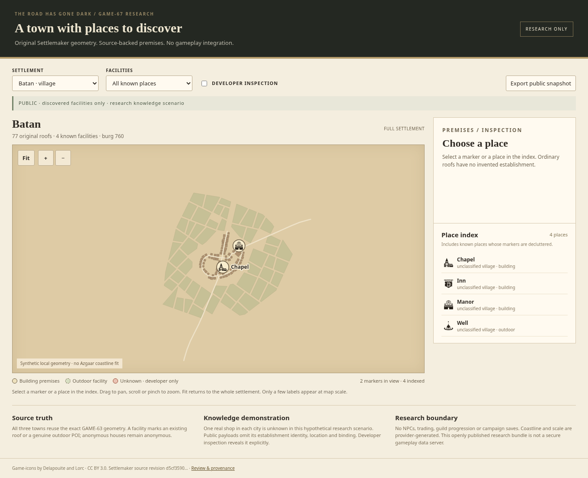
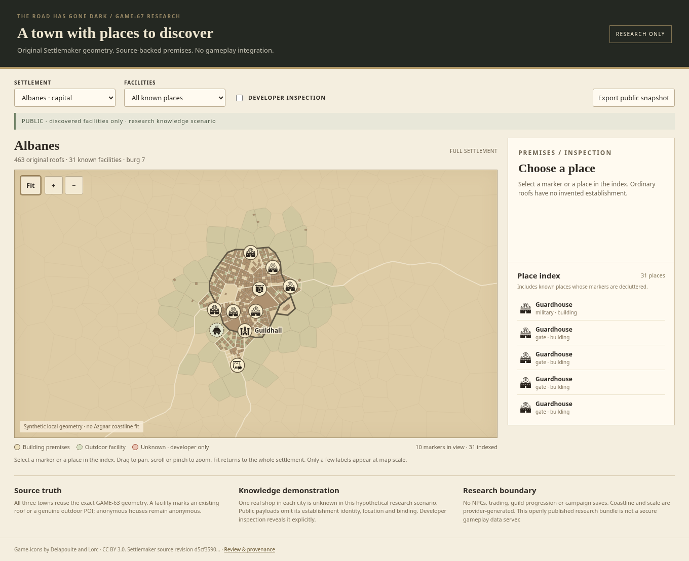
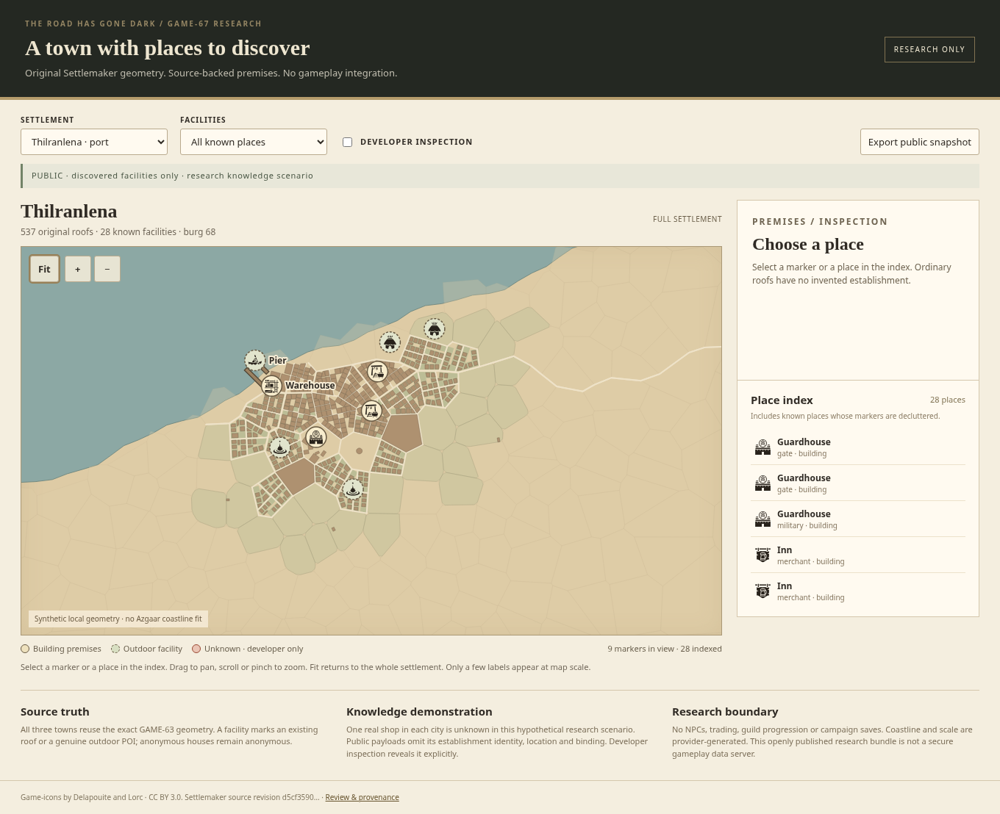

# GAME-67: inspectable Settlemaker facilities

**Research prototype, ready for visual review; not accepted or integrated.**
Existing draft [PR #51](https://github.com/marksprietsma-beep/road-has-gone-dark/pull/51)
is the delivery target. [Linear GAME-67](https://linear.app/marksprietsma/issue/GAME-67)
remains open for Mark's review. GAME-19 remains backlog.

This viewer makes genuine GAME-63 buildings and outdoor facilities selectable.
It uses the original Batan, Albanes and Thilranlena geometry, a deterministic
provider-neutral establishment model, and separate public/developer payloads.
The map treatment is a geometry render with project Game-icons overlays: it is
not a regenerated town or a reproduction of every original roof texture.
All changes are confined to `research/game67/`. No production scene, GAME-62
implementation, canonical world fixture, save contract or gameplay changed.

## Start with the evidence

The screenshots below were rendered by Chromium 151.0.7922.173 through Playwright
1.60.0, at 1360×1000 desktop and 390×844 mobile viewport sizes. Full-page images
may be taller. **These are actual PNG captures**, not illustrative mockups.
Click an image for full resolution; the mobile links show a legible phone layout.

### Batan: a village, not a miniature capital

77 original roofs; chapel, inn and manor use explicit existing landmark building
IDs. The fourth facility is the outdoor well. No guildhall was invented.



[District view](evidence/batan-medium.png) · [Inn selected, original roof highlighted](evidence/batan-close.png)
· [Phone overview](evidence/batan-mobile-fit.png) · [Phone inn details](evidence/batan-mobile-close.png)

### Albanes: the guildhall becomes a real place

463 original roofs; 32 source POIs, 27 building-bound and 5 outdoor. The public
research scenario includes 31 known facilities because one real shop is unknown.
The guildhall is visible at whole-town scale and selects original provider roof
`b93`, in the administration ward.



[Guildhall district](evidence/albanes-medium.png) · [Guildhall premises and provenance](evidence/albanes-close.png)
· [Phone overview](evidence/albanes-mobile-fit.png) · [Phone guildhall details](evidence/albanes-mobile-close.png)

### Thilranlena: waterfront premises and outdoor piers

537 original roofs; 29 source POIs, 21 building-bound and 8 outdoor. The warehouse
uses actual harbour roof `b223`; the two piers remain outdoor POIs. Public scenario:
28 known facilities. Water is preserved from the original Scene, because city
GeoJSON omits it. **The shore is synthetic, not the authoritative Azgaar coast.**



[Harbour district](evidence/thilranlena-medium.png) · [Warehouse premises](evidence/thilranlena-close.png)
· [Phone overview](evidence/thilranlena-mobile-fit.png) · [Phone warehouse details](evidence/thilranlena-mobile-close.png)

### Unknown information stays out of the public payload

[Public Albanes, with the unknown shop absent](evidence/albanes-public.png) versus
[explicit developer inspection of that real shop](evidence/albanes-developer-hidden.png).
The developer example is unmistakably marked. Its real provider building is `b12`.
Public JSON, the public place index, public map state, and downloaded public
snapshots omit the undiscovered establishment record. Anonymous roof geometry
remains visible without that association. Developer data is fetched only on opt-in.

The openly published source fixtures and developer samples are research materials,
not secure campaign storage. Future production must withhold privileged payloads
on the server. See [SCHEMA.md](SCHEMA.md) for the exact boundary.

## What works

- Switch between the three original settlements, fit, pan, zoom, pinch, keyboard
  navigation, and a mobile layout with readable controls and details.
- Markers and place index select the same real establishment. Highlighting selects
  the original bound polygon, and outdoor places remain distinct dashed markers.
- Screen-space decluttering prioritizes civic, worship and harbour landmarks;
  only a few labels appear at full scale. Every eligible place remains selectable
  through the index even when its marker is decluttered or outside the viewport.
- Detail panels show type/function, unnamed status, settlement, district, canonical
  building identity, original provider evidence, knowledge, and unknown availability.
  No owners, guild progression, inventories, quests or lore are fabricated.
- Filters show hospitality, workplaces, major landmarks or outdoor places.
- Developer inspection reveals a deliberately hypothetical unknown-shop scenario.
  Its hide/discover button changes research state; public exports preserve it.
  Switching settlement/audience reloads the committed scenario, not a game save.
- Versioned deterministic identities, binding validation, serialization and privacy
  tests operate independently of the renderer and the provider runtime.

## Open the viewer

From the repository root:

```sh
python3 -m http.server 8767 --bind 127.0.0.1 --directory research/game67
```

Open the server's `index.html` in a browser on that machine. Opening the HTML
straight from the filesystem is insufficient for ES modules and JSON fetches.
The committed samples run without npm installation, Settlemaker, Godot, or an API
key. GitHub displays screenshots and source, but does not execute HTML from a blob
page; no GitHub Pages deployment is claimed. For mobile review, use the six phone
PNGs above. Hosting this static research folder is possible as a separate task.

Select a marker or an index row. **District view** and **Premises view** center the
selected location. Drag or use arrow keys to pan; wheel/pinch or +/− to zoom; **Fit**
or F restores the whole town. Developer inspection is an explicit opt-in, and
**Export public snapshot** remains sanitized even in developer mode.

## Exact validation and reproduction

Executed in this cloud instance with Node 24.19.0 and Python 3.12:

```sh
node research/game67/scripts/build.mjs
node --test research/game67/tests/model.test.mjs
# With the static server running as above:
node research/game67/scripts/browser-check.mjs
# Original archive validation/fixture derivation:
/workspace/.runtime/archive-tools/bin/python research/game67/scripts/import-game63.py
```

The archive tool environment was installed outside the checkout using:

```sh
python3 -m venv /workspace/.runtime/archive-tools
/workspace/.runtime/archive-tools/bin/pip install py7zr==1.1.3
```

`import-game63.py` uses the original four volumes already on main and the preserved
GAME-63 holding commit, compares their actual Git bytes, tests 7z CRCs and all
internal checksums, then derives compact fixtures with verified checksums. It
NEVER calls the town generator. If the holding commit is missing locally, fetch
`handoff/game-63-settlemaker-upload` from origin first.

The browser runner reuses Playwright from the existing locked
`vendor/azgaar/node_modules/playwright` dev tools. Reproduce that prerequisite with
`npm ci --ignore-scripts --prefix vendor/azgaar`. Use installed Chromium; set
`CHROMIUM_PATH` if it is not `/usr/bin/chromium`, or `GAME67_URL` for another local
server port. Production dependency declarations and lockfiles are unchanged.

| Check | Actual result |
| --- | --- |
| Four volumes versus holding-branch Git objects | Byte-identical |
| Reconstructed archive CRC / internal hashes | Passed / 37 of 37 passed |
| Exact source-derived fixtures | All 3 verified |
| Model tests | 21 passed, 0 failed, 0 skipped |
| Browser checks | 23 passed, 0 failed; no page errors |
| Render captures | 17 real PNGs; desktop/mobile, fit/district/premises and knowledge separation |
| Remote CI for research changes | No check runs or status contexts reported; existing workflows exclude this folder |
| Original bundled upstream tar | FAILED gzip integrity despite matching its historical recorded checksum; not used |
| Historical GAME-63 upstream tests | Logs preserved; not rerun in GAME-67 |

See [model test output](evidence/model-tests.txt), [browser result record](evidence/browser-results.json),
[source audit](SOURCE-AUDIT.md), [source hashes](fixtures/provenance.json),
[contract](SCHEMA.md), and [interchange outline](facility.schema.json).

The 21 model tests cover deterministic replay and rename stability, burg identity,
unique facility IDs, association/knowledge round trips, exact original polygons,
valid interior anchors, outdoor semantics, duplicate/orphan rejection, point-in-
polygon boundaries/holes, privacy, landmark priority, repeatable decluttering,
sample regeneration and layout-version changes. The browser checks exercise real
selection, controls, public fetch boundaries, exports, discovery, filters, mobile
overflow, map taps and pinch zoom. Geometry payloads are not mutated to draw a marker.

## Visual inspection and remaining design questions

The agent inspected the actual whole-town, district and premises images and phone
captures. Batan stays small; at whole-town scale its few landmark markers are
sparse and the index makes hidden-by-decluttering places accessible. Albanes's
guildhall is apparent at fit scale and highlights the intended roof on selection.
The port's warehouse and outdoor pier are legible against the source water.
Selected details remain readable at phone width, and labels use 12px text with
parchment halos and collision reservation. These observations are visual review,
not a claim that screenshot automation establishes artistic acceptance.

This geometry-only treatment is deliberately simpler than GAME-63's original
roof textures and crop artwork. It is still regular and schematic, and it does
not resolve the repository's retro pixel-art direction versus vector maps.
Generic reused icon categories are not all exact facility-specific pictograms:
smithy/mine and guildhall/capital especially need Mark's approval or later artwork.
Several same-type facilities remain unnamed; source IDs distinguish them in details.

## Provenance, licensing and integration risks

Original research: [GAME-63 holding branch](https://github.com/marksprietsma-beep/road-has-gone-dark/tree/handoff/game-63-settlemaker-upload/handoffs/GAME-63),
upstream [Settlemaker at d5cf3590cf59e1d382110d25a6910f12507299e2](https://github.com/barrulus/settlemaker/tree/d5cf3590cf59e1d382110d25a6910f12507299e2).
The four-volume archive is referenced, not re-added to this diff. The old unpublished
GAME-67 commit/ZIP were not recovered; this is a clearly authorized fresh rebuild.

The source engine is **GPL-3.0-only**, derived from watabou's TownGeneratorOS.
No engine implementation is vendored into this research folder or shipping game.
The six default artwork collections have **CC BY 4.0 with a rendered-output
exception**; redistribution of their actual libraries still requires per-author
attribution. Copperline has separate GPL terms and is not used. This renderer
uses source geometry with its own simple fills, not those symbol libraries.
[Game-icons attribution](assets/ATTRIBUTION.md) covers unchanged selected project
art by Delapouite/Lorc under CC BY 3.0. Future distribution requires a separate
licensing decision; this research is not legal clearance for engine integration.

The bundled upstream tar is truncated. Exact upstream source was independently
checked out to inspect licence text; it was not used to fabricate replacements.
Scene/GeoJSON scale estimates disagree, and some Scene artwork layers have
coverage differences. Coordinates retain provider units; no physical distances,
travel times, actual coastline fit or geographical authority are asserted.
Determinism proves these preserved inputs and schema version, not broad seeds or
cross-version provider ID stability. Layout upgrades require explicit migration,
not silent rebinding of player discoveries. No campaign persistence is implemented.

## Recommendation and next decision

**Viable as a conditional, replaceable settlement provider.** The genuine source
facilities supply enough semantics for a useful inspection layer, and this prototype
proves binding and a knowledge boundary. It is not ready for production integration.

Mark should approve or reject the three-level marker hierarchy, selected-roof/detail
interaction, phone layout, simplified map treatment and reused icon shortlist.
Then choose whether to proceed to a separately authorized geographical/scale and
licensing feasibility step. GAME-19 integration needs its own approval afterward.

An eventual adapter could take immutable world/burg identity and measured entrance,
coast and scale constraints from GAME-62, retain original provider geometry and
completeness diagnostics, and link region arrival anchors to settlement premises.
Unsupported transformations must be rejected or marked degraded, not quietly
invented. No such connection or production save migration has been implemented.

[Prepared Linear update](LINEAR-UPDATE.md) supplies source links and results.
Authenticated Linear access was unavailable; no status change or acceptance is claimed.
