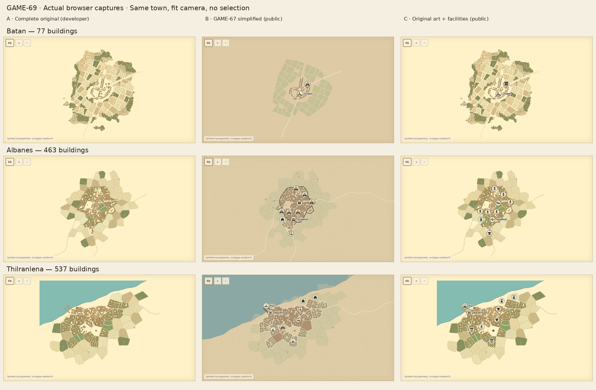

# GAME-69 — Original settlement artwork with inspectable facilities

A stacked visual research prototype for Mark's review. It reuses unchanged GAME-67
models, controls, selection, decluttering and public export while placing genuine
archived GAME-63 illustrations underneath. No town regeneration, gameplay,
production integration, permanent art choice or merge.

[Draft PR #52](https://github.com/marksprietsma-beep/road-has-gone-dark/pull/52) ·
Head `research/game-69-settlement-art` · Base `review/game-67-facilities-recovery`.

Base: GAME-67 `740f1910787cafae172fdf5d74777bbb032b92a0`,
[upstream draft PR #51](https://github.com/marksprietsma-beep/road-has-gone-dark/pull/51).
All additions are under `research/game69/`; the 57 GAME-67 files remain unchanged.
The original archives and source data remain unchanged too.

## Evidence to review first

[Desktop A/B/C contact sheet](evidence/comparison-desktop.png) ·
[Phone-friendly contact sheet](evidence/comparison-phone-layout.png).
These compose actual browser stage screenshots at the same fit camera without
selection. The phone-friendly sheet rearranges desktop captures; it is not a mobile
browser test. Actual mobile captures are separately linked below.



| Original town | Whole settlement C | District C | Selected premises C | Actual mobile inspection |
| --- | --- | --- | --- | --- |
| Batan, 77 buildings | [Fit](evidence/batan-C-fit.png) | [Inn district](evidence/batan-C-medium.png) | [Inn roof](evidence/batan-C-close.png) | [Fit](evidence/batan-mobile-fit.png), [inn details](evidence/batan-mobile-close.png) |
| Albanes, 463 buildings | [Fit](evidence/albanes-C-fit.png) | [Guildhall district](evidence/albanes-C-medium.png) | [Guildhall b93](evidence/albanes-C-close.png) | [Fit](evidence/albanes-mobile-fit.png), [guildhall details](evidence/albanes-mobile-close.png) |
| Thilranlena, 537 buildings | [Fit](evidence/thilranlena-C-fit.png) | [Harbour district](evidence/thilranlena-C-medium.png) | [Warehouse b223](evidence/thilranlena-C-close.png) | [Fit](evidence/thilranlena-mobile-fit.png), [warehouse details](evidence/thilranlena-mobile-close.png) |

Batan retains the inn, chapel, manor and outdoor well; no guildhall is invented.
Albanes retains walls, towers and the real guildhall building. Thilranlena retains
original water, harbour, warehouse and outdoor piers. Its coastline is **synthetic
Settlemaker geography, not authoritative Azgaar geography**. No world placement or
verified physical distance is asserted.

| Town | A: complete original illustration | B: inherited simplified geometry | Alignment diagnostic |
| --- | --- | --- | --- |
| Batan | [Original](evidence/batan-A-fit.png) | [GAME-67](evidence/batan-B-fit.png) | [Footprints](evidence/batan-alignment.png) |
| Albanes | [Original](evidence/albanes-A-fit.png) | [GAME-67](evidence/albanes-B-fit.png) | [Footprints](evidence/albanes-alignment.png) |
| Thilranlena | [Original](evidence/thilranlena-A-fit.png) | [GAME-67](evidence/thilranlena-B-fit.png) | [Footprints](evidence/thilranlena-alignment.png) |

[Public Albanes](evidence/albanes-public.png) and
[explicit developer inspection](evidence/albanes-developer.png) demonstrate the
knowledge separation. A is explicitly privileged complete-art research. B and C
comparison captures use the same public facility model.

## What works

Use the art selector to compare A (complete original), B (GAME-67 simplified) and
C (original-art interactive public overlay). A enables developer context because
complete originals contain semantic source artwork and metadata; leaving developer
context exits A. C starts public. Public imagery preserves source coordinates but
neutralizes two hypothetical unknown-shop symbols, documented in [ALIGNMENT.md](ALIGNMENT.md).

Click/tap a facility on the map or index to highlight the exact original building
polygon and inspect its details. Fit, drag, wheel, touch pinch, district/premises
views, filtering, marker decluttering and public export use the existing GAME-67
implementation. Outdoor markers remain outdoor; no fabricated roof is assigned.
Selection fill is restrained so original roof detail stays visible. Optional
anonymous-footprint outlines make alignment reviewable. Source IDs and building
associations are unchanged.

Markers remain in the approved Game-icons family, with an actual meeting-table
symbol for guildhall and anvil for smithy. The 13 semantic candidates and individual
credits are in [ATTRIBUTION.md](assets/ATTRIBUTION.md) and
[icon-manifest.json](assets/icon-manifest.json). No approved global icon is replaced.

## Run and reproduce

Check out this branch including its GAME-67 parent. From repository root:

```sh
python3 -m http.server 8769 --bind 127.0.0.1 --directory research
```

Open `http://127.0.0.1:8769/game69/` in your own browser. This local address is a run
instruction, not a published preview. Both sibling research directories are required;
GAME-69 loads GAME-67's existing DOM/script/styles/models rather than duplicating its
renderer. No API, generator, Godot or build step is needed to inspect committed maps.

To reproduce tests and evidence, install the pinned project npm dependencies and
Python artwork tools if absent, then keep the server above running:

```sh
npm ci --ignore-scripts --prefix vendor/azgaar
python3 -m venv /tmp/game69-art-tools
/tmp/game69-art-tools/bin/pip install py7zr==1.1.3 Pillow==12.3.0
/tmp/game69-art-tools/bin/python research/game69/scripts/prepare-art.py
```

```sh
/tmp/game69-art-tools/bin/python research/game69/scripts/prepare-icons.py
node --test research/game67/tests/model.test.mjs
python3 -m unittest discover -s research/game69/tests -p 'test_*.py' -v
GAME67_URL=http://127.0.0.1:8769/game67/ node research/game69/scripts/check-game67.mjs
node research/game69/scripts/browser-check.mjs
/tmp/game69-art-tools/bin/python research/game69/scripts/contact-sheet.py
```

Use installed Chromium (`/usr/bin/chromium`, or `CHROMIUM_PATH`) and optionally
`GAME69_URL` for the new browser runner. Contact sheets use DejaVu Sans from the
standard Linux fonts path. Icon reproduction needs GitHub network access; committed
assets do not. The art preparer verifies the four root archive volumes, reconstructed
7z CRC, 37 internal checksums and exact source geometry. It never runs Settlemaker.
Original SVG bytes are copied intact; hashes, transforms, paint-anchor measurements
and public preparation are recorded in [art/manifest.json](art/manifest.json).
The public viewer fetches only sanitized [frames.json](art/frames.json), not that
privileged manifest. [Preparation log](evidence/art-preparation.txt).

## Executed validation

All these suites were executed in this environment for GAME-69; the inherited tests
below are fresh runs, not just the historical GAME-67 evidence.

| Suite | Actual result | Evidence |
| --- | --- | --- |
| GAME-67 model | 21 passed, zero failed/skipped | [Log](evidence/game67-model-tests.txt) |
| Unchanged GAME-67 browser assertions | 23 passed, zero page errors | [Log](evidence/game67-browser-tests.txt), [results](evidence/game67-browser-results.json) |
| New artwork/model/privacy tests | 10 passed | [Log](evidence/art-tests.txt) |
| New GAME-69 browser | 44 checks passed; zero script/loading errors | [Log](evidence/browser-tests.txt), [results and screen residuals](evidence/browser-results.json) |
| Visual evidence | 35 actual browser PNGs plus 2 composed contact sheets | [Evidence directory](evidence) |

Node 24.19, Chromium 151 and Playwright 1.60 were used. Desktop viewport is
1360×1050; touch/mobile Chromium emulation is 390×844. Mobile captures are full-page
captures, so their height exceeds the viewport. This does not establish Safari or
physical iPhone/Android hardware compatibility. Repeated settled stage renders in
the same browser instance were pixel-identical; cross-platform pixels are not claimed.
The inherited browser wrapper runs unchanged assertions with a temporary output
location; its 17 transient screenshots are discarded to avoid duplicating the
published GAME-67 evidence or altering parent files.

Measured roof anchors agree within 0.002439 supplied source units for Batan and
0.006905 city-local units for the two cities. The tested district/close facility
projections are below half a screen pixel. Guildhall b93 residual is 0.003972 units;
warehouse b223 is 0.002501 units. These are measured rounding residuals, not proof
of identical roof silhouettes: original overhangs and shadow offsets are preserved.
Four city polygons lack individual source paint tags (Albanes b60/b299, Thilranlena
b331/b414). Their geometry/art remain, but independent ID-level paint verification
is unavailable. See the complete [alignment explanation](ALIGNMENT.md).

## Visual assessment and recommendation

| Criterion | A: original output | B: GAME-67 simplified | C: original-art interactive overlay |
| --- | --- | --- | --- |
| Fantasy atmosphere | Strong hand-drawn settlement detail; warm palette | Schematic, less roof and landscape texture | Original detail retained with restrained functional overlays |
| World/region consistency | Provider illustration has its own palette and framing | Existing project proxies, but flattened local artwork | Same approved icon family; provider palette still needs Mark's approval |
| Building readability | Roofs/walls/towers naturally differentiated | Anonymous polygons readable, roof variation lost | Real source roofs plus exact selected footprint; original shadows/overhangs retained |
| Functional markers | None in art comparison | Existing working markers; guildhall/smithy proxies approximate | Same bindings, clearer semantic candidates, stable screen-size markers |
| Art cohesion | Most faithful complete illustration | Consistent simplified terrain but less distinctive towns | Faithful landscape; markers introduce UI contrast; only public unknown symbols neutralized |
| Zoom | Vector source detail scales cleanly | Vector simplified shapes scale cleanly | Vector illustration scales with the canonical overlay; district/close inspection tested |
| Mobile | Artwork alone offers no inspection | Existing responsive/touch interactions | Same interactions and meaningful details demonstrated at 390px; dense urban fit view relies on index/zoom |
| Architecture | Simple image layer | Existing model/renderer | Reuses parent renderer, six self-contained SVGs and a small mode wrapper; not production integration |
| Licensing | Original completed-map output exception documented | Existing GAME-67 terms | Original output terms plus individually attributed CC BY 3.0 Game-icons derivatives |

Recommend **C as the candidate for Mark's visual review**: keeping complete original
illustration layers preserves far more of the towns than reconstructing provider
art from generic polygons, and measured source transforms let the existing facility
model remain interactive. A remains the fidelity reference and B the functional
baseline. This recommendation does not choose a permanent renderer or approve art.

Remaining limits: the source's original rectangular crop is retained (including the
port water edge); no surrounding geography is invented. Native frame rounding,
four missing paint tags and stylized roof/footprint differences remain documented.
The six SVGs total about 8.6 MB before transfer compression; browser image decoding
is cached, but memory/performance has not been benchmarked on low-end hardware.
The viewer has browser-side public/developer separation, not server authentication:
this published research includes privileged originals and audit files. Production
must withhold those files. Settlemaker engine GPL-3.0-only and the default artwork
licence are separate; no engine implementation or Copperline library is vendored.
See [licence findings](assets/ATTRIBUTION.md) before any future integration.

Authenticated Linear access was unavailable. The uploaded GAME-69 specification,
GAME-67 review documents and original archive were read; GAME-69/GAME-67/GAME-63/
GAME-19 Linear issue contents/statuses were not independently fetched or updated.
[Prepared Linear update](LINEAR-UPDATE.md) is provided for review.

[Publication verification](DELIVERY.md) records the remote checks and scope audit.
