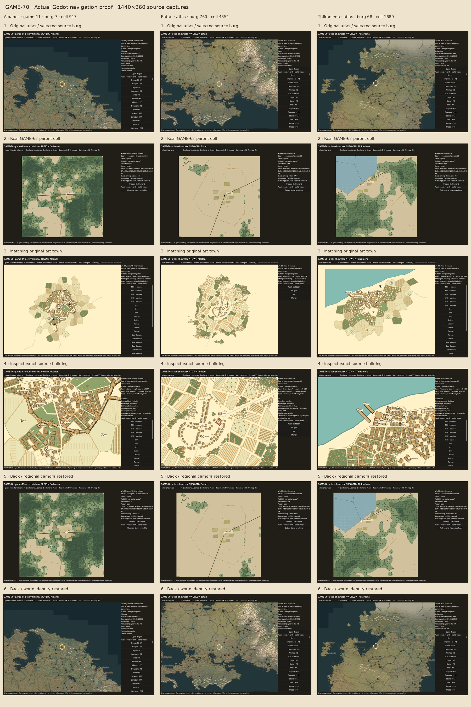

# GAME-70 — Godot world → region → town navigation proof

Launch **`scenes/debug/world_region_town_flow.tscn` with F6** in Godot 4.6.
[Open draft PR #53](https://github.com/marksprietsma-beep/road-has-gone-dark/pull/53),
head `research/game-70-map-flow`, base `research/game-69-settlement-art`.
This is a working native Godot debug scene, stacked on GAME-69. It is not linked
from the main game and does not change gameplay, saves, original fixtures,
GAME-62, GAME-67 or GAME-69. No source town is regenerated.

## Review the three journeys

From the repository root, open `project.godot` in Godot and let imports finish.
Open the scene above and press F6. Alternatively:

```sh
godot --path . --editor --import
godot --path . scenes/debug/world_region_town_flow.tscn
```

1. Click **Bookmark: Albanes**, **Bookmark: Batan**, or **Bookmark: Thilranlena**.
   The original illustrated Azgaar atlas selects the real burg and source parent
   cell. The inspector shows its name, ID, source world, seed, cell and coordinates.
2. Click **Open Region**. The accepted GAME-62 renderer shows the prepared region
   for that exact cell, with the original source position highlighted. Select the
   burg on the map or its regional index; click **Inspect Settlement**.
3. The matching GAME-69 option C public artwork appears inside Godot. Select the
   **Inn** in Batan, **Guildhall** in Albanes, or **Warehouse** in Thilranlena using
   a marker, the real known roof, or the right-hand facility index. Click
   **Focus selected premises** to inspect the exact building outline and metadata.
4. Click **Back to region**, then **Back to world**. Camera, zoom, burg and region
   identity are restored. Repeat: the town camera and selected facility are also
   restored. Explicitly changing source worlds clears the stale burg selection.

Mouse wheel zooms about the cursor; middle drag and arrows pan; **F** or **Fit map**
fits the current map; **Esc** goes back when the map has keyboard focus. The world
selector switches the two canonical fixtures. The public source-burg index can
inspect other real towns, including small/decluttered atlas markers. Only the three
requested parent cells have prepared region/town proof assets; other burgs are
explicitly unavailable, with no arbitrary substitute or runtime generation.

| Town | Canonical source world | Burg ID | Real cell | Town test |
| --- | --- | ---: | ---: | --- |
| Albanes | game-11-determinism | 7 | 917 | Guildhall b93, 463 buildings |
| Batan | atlas-showcase | 760 | 4354 | Original inn, 77 buildings; no guildhall |
| Thilranlena | atlas-showcase | 68 | 1689 | Warehouse b223, 537 buildings; outdoor piers |

All transitions check canonical fixture SHA, world seed, burg ID and parent cell.
Numeric burg IDs can repeat across worlds: a matching number alone never resolves
the town research. Region identities and local positions are recorded in
[journeys.json](journeys.json).

## Actual Godot evidence

[Six-stage contact sheet](evidence/journeys-contact-sheet.png), composed solely from
the 18 original Godot viewport captures linked below. No browser screenshots or
mock-ups are included in this proof.



| Journey | World | Exact region | Detailed town | Facility inspection | Return region | Return world |
| --- | --- | --- | --- | --- | --- | --- |
| Albanes | [Atlas](evidence/albanes-world.png) | [Cell 917](evidence/albanes-region.png) | [Town](evidence/albanes-town.png) | [b93 guildhall](evidence/albanes-facility.png) | [Back](evidence/albanes-return-region.png) | [Back](evidence/albanes-return-world.png) |
| Batan | [Atlas](evidence/batan-world.png) | [Cell 4354](evidence/batan-region.png) | [Town](evidence/batan-town.png) | [Inn](evidence/batan-facility.png) | [Back](evidence/batan-return-region.png) | [Back](evidence/batan-return-world.png) |
| Thilranlena | [Atlas](evidence/thilranlena-world.png) | [Cell 1689](evidence/thilranlena-region.png) | [Town](evidence/thilranlena-town.png) | [b223 warehouse](evidence/thilranlena-facility.png) | [Back](evidence/thilranlena-return-region.png) | [Back](evidence/thilranlena-return-world.png) |

Screenshots are 1440×960 root Godot viewport captures using Godot 4.6.3,
Compatibility renderer, Xvfb and Mesa llvmpipe. The same authored F6 scene is
instantiated by the graphical runner. UI button signals and actual SubViewport
mouse/key events drive the journeys; camera restoration is checked exactly.
The virtual display warning that V-Sync cannot be changed is expected. Audio is
set to Dummy for tests; there is no audio/gameplay requirement.

## Executed tests and reproduction

All final checks passed: **10 new Node tests, 226 native Godot assertions**, and
18 actual Godot captures plus one composed sheet. Existing GAME-62 generator and
Godot smoke, accepted world inspection, GAME-67 model (21 tests) and browser
(23 checks) suites passed again. No final script/loading errors; Xvfb reports
an expected V-Sync warning.

[New source log](evidence/source-tests.txt) · [Godot log](evidence/godot-tests.txt) ·
[Checks, captures and timings](evidence/godot-results.json) ·
[GAME-62 generator](evidence/game62-generator-tests.txt) ·
[GAME-62 Godot](evidence/game62-godot-tests.txt) ·
[World Godot](evidence/world-godot-tests.txt) ·
[GAME-67 model](evidence/game67-model-tests.txt) ·
[GAME-67 browser](evidence/game67-browser-tests.txt).

Reproduce assets and tests from repository root, with project npm dependencies,
Python/Pillow, librsvg `rsvg-convert`, Godot and a graphical display:

```sh
node research/game70/scripts/prepare-regions.mjs
python3 research/game70/scripts/prepare-art.py
godot --headless --editor --path . --import
node --test research/game70/tests/source.test.mjs
godot --path . --audio-driver Dummy --rendering-method gl_compatibility --script research/game70/tests/capture-flow.gd
python3 research/game70/scripts/contact-sheet.py
```

## Review limits

The town screen explicitly warns that **Settlemaker-local coast, streets and extent
are not fitted to GAME-62/Azgaar geography**. This seam is deliberately visible;
no physical travel scale, gameplay or geographical integration is claimed.
Town artwork is a faithful 4096px raster of the preserved public SVG, with exact
supplied frame coordinates and original polygon selection. Extreme zoom can expose
raster softness. Four inherited city roofs lack individual artwork measurement IDs.

First atlas loads took about 10–11 seconds on this software renderer; cached world
switches measured about 95–98 ms. Latest repeated town loads were 0–6 ms and region
loads 29–80 ms; these are debug observations, not hardware guarantees. The desktop
F6 scene is tested; exported builds, mobile and low-memory hardware are unverified.
Only the three requested regions are prepared. No runtime town/region generation.

[Implementation and reproduction details](IMPLEMENTATION.md) document renderer reuse,
source hashes, licence findings, public filtering, earlier failures and corrections.
No GPL Settlemaker engine is vendored; existing artwork and Game-icons attribution
carry forward. Public mode never loads developer town payloads, while privileged
research remains openly present elsewhere in the repository.

Authenticated Linear access was unavailable; the uploaded brief and repository
research were used. No Linear issue status was changed. Publication is a new draft
based on GAME-69; PRs #51/#52 and main remain unchanged. No merge.

[GitHub delivery verification](DELIVERY.md).
