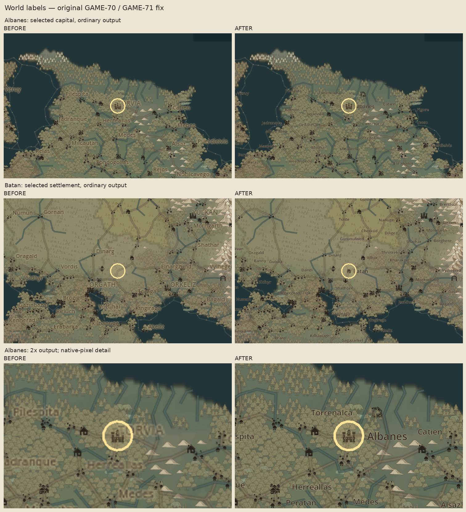
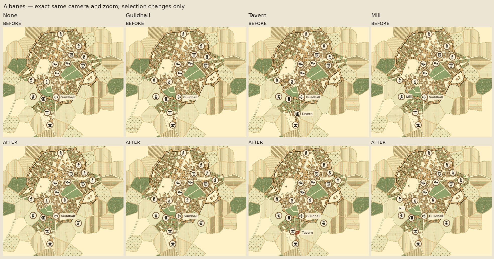

# GAME-71/72 — native-resolution atlas labels and stable facility markers

Review branch: `fix/game-71-72-map-presentation`, stacked on GAME-70
`10b8dcdfb480366e92018098923500efeb88db35`. The pre-implementation assessment and
push gate are in [ENGINEERING-PLAN.md](ENGINEERING-PLAN.md).

## Verified causes and changes

The original world text used 7–8 map-unit glyphs, camera-scaled duplicate halos,
and character-count collision estimates. Independent landmark label claims disagreed
with settlement eligibility. At 2880×1920 the map still rendered only 1108×845
pixels: the stretched texture added real blur. These measurements confirmed the
brief's viewport hypothesis; changing font sizes alone would leave it unresolved.

World text now uses Godot font metrics, native pixel drawing, a thin parchment
outline, stable source-ID tie breaks and measured collision rectangles. Selected
settlements, capitals and population take precedence over contextual state names.
The existing settlement zoom/population gates progressively disclose smaller names;
selected settlements remain eligible. Labels reserve actual visible icon bounds.
A selected name can use a nearby clear position with a short source-anchored leader
when adjacent positions are congested. Original icon coordinates and hit tests stay intact.
The common helper is `ScreenLabelLayout`; label layout is cached until relevant
camera, window, density, visibility or selection inputs change.

A small TextureRect/SubViewport adapter renders to the physical map pixel size
(2216×1690 at 2×; 1385×1056 at 125%). Logical camera state and zoom bands stay independent
of output density; GUI coordinates are converted back into native viewport pixels.
Both 16:9 letterboxing and 3:2 windows were exercised with actual GUI events.

The original town renderer sorted selection first and collided combined icon/label
rectangles. A label collision suppressed its marker and clickable target. Actual
before captures reproduce selection churn in **all three** settlements.
Markers now use selection-independent priority/ID ordering at fixed source anchors.
Nearby known facilities join stable numbered groups; no marker is relocated.
Labels use a separate measured pass, with selection affecting labels/highlights only.
Exact known building-roof clicks take precedence; group hits choose the nearest
known premise. The complete right-hand index remains available, including outdoor
facilities and clustered members. Unknown facilities are excluded throughout.

| Town, same fit view | Original pins | Fixed pins / visible known group members |
| --- | ---: | ---: |
| Albanes | 15; Mill selection drops to 14 | 18 / 31 |
| Batan | 3; Inn selection changes identities | 3 / 4 |
| Thilranlena | 12; Tavern selection drops to 11 | 14 / 28 |

Fixed marker IDs, positions and membership are identical across all four tested
selections in each town. The selected premises retain their canonical polygons.
Clustering changes with camera zoom, never with unrelated selection.

## Actual rendering evidence

Linux Godot **4.6.3**, GL Compatibility, Mesa llvmpipe, Xvfb 3840×2160. No invented
screenshots: 24 unchanged GAME-70 baseline captures, 24 matching after captures,
and five additional real window/input captures. Comparison sheets contain only
labelled, unscaled crops of those images.

[World before/after](evidence/world-comparison.png) ·
[Albanes selection comparison](evidence/town-selection-comparison.png) ·
[Native 4K input capture](evidence/input-world-3840x2160.png)




Full frames (each has a matching `before-` file in `evidence/`):

| World | Fit | Medium | Dense close | Selected | 2× | 125% |
| --- | --- | --- | --- | --- | --- | --- |
| game-11-determinism | [PNG](evidence/after-game-11-determinism-fit.png) | [PNG](evidence/after-game-11-determinism-medium.png) | [PNG](evidence/after-game-11-determinism-dense.png) | [Albanes](evidence/after-game-11-determinism-selected.png) | [PNG](evidence/after-game-11-determinism-selected-2x.png) | [PNG](evidence/after-game-11-determinism-selected-125.png) |
| atlas-showcase | [PNG](evidence/after-atlas-showcase-fit.png) | [PNG](evidence/after-atlas-showcase-medium.png) | [PNG](evidence/after-atlas-showcase-dense.png) | [Batan](evidence/after-atlas-showcase-selected.png) | [PNG](evidence/after-atlas-showcase-selected-2x.png) | [PNG](evidence/after-atlas-showcase-selected-125.png) |

| Town | No selection | Selection 1 | Selection 2 | Selection 3 |
| --- | --- | --- | --- | --- |
| Albanes | [PNG](evidence/after-albanes-none.png) | [Guildhall](evidence/after-albanes-guildhall.png) | [Tavern](evidence/after-albanes-tavern.png) | [Mill](evidence/after-albanes-mill.png) |
| Batan | [PNG](evidence/after-batan-none.png) | [Inn](evidence/after-batan-inn.png) | [Well](evidence/after-batan-well.png) | [Manor](evidence/after-batan-manor.png) |
| Thilranlena | [PNG](evidence/after-thilranlena-none.png) | [Warehouse](evidence/after-thilranlena-warehouse.png) | [Tavern](evidence/after-thilranlena-tavern.png) | [Pier](evidence/after-thilranlena-pier.png) |

Machine-readable camera, native viewport, labels and membership records:
[baseline](evidence/baseline.json), [presentation](evidence/presentation-results.json),
[input](evidence/input-results.json), [navigation](evidence/game70-results.json).

## Executed checks

| Check | Actual result / saved log |
| --- | --- |
| 24 matched Godot render scenarios | PASS, 33,255 assertions including pairwise bounds checks; [log](evidence/presentation-tests.txt) |
| Native input, logical keyboard pan, all index entries, source roofs, unknown-data rejection, clusters, pan/zoom, five window sizes | PASS, 271 assertions; [log](evidence/input-tests.txt) |
| Original GAME-70 native repeated world → region → town → facility → return flows, all three towns | PASS, unchanged 226 assertions; [log](evidence/game70-tests.txt) |
| New evidence, selection invariance, resolution, overlap and authorised-scope checks | PASS, 7; [log](evidence/evidence-tests.txt) |
| Original GAME-70 functional Node checks | PASS, 9; [log](evidence/game70-source-tests.txt) |
| GAME-69 original art/hash/geometry/hidden-redaction checks | PASS, 9; [log](evidence/game69-art-tests.txt) |
| GAME-67 model | PASS, 21; [log](evidence/game67-model-tests.txt) |
| Original GAME-67 browser / GAME-69 browser | PASS, 23 / 44; [67 log](evidence/game67-browser-tests.txt), [69 log](evidence/game69-browser-tests.txt) |
| GAME-62 generator | PASS, six-case deterministic replay, privacy, coordinates, IDs and adjacent-cell checks; [log](evidence/game62-generator-tests.txt) |
| GAME-62 Godot | PASS, six scenes, inspection, privacy, failed-load reset; [log](evidence/game62-godot-tests.txt) |
| World inspection / key / save contract | PASS; [inspection](evidence/world-inspection-tests.txt), [key](evidence/world-key-tests.txt), [save](evidence/save-world-tests.txt) |

Two inherited **task-specific scope guards** were excluded: GAME-70's check permitting
only GAME-70 additions and GAME-69's check requiring all production scripts to remain
unchanged since GAME-67. They necessarily conflict with this authorised presentation
assignment. All their functional assertions ran unchanged; the new seventh Node test
checks the exact seven allowed presentation scripts plus this QA directory, and
requires canonical data, accepted generators, original research/art, main scene and
save files to remain byte-unchanged. This is not a claim that every original test ran.

During development a dense 2× case rejected the selected capital label; its genuine
failure log is retained as `first-layout-failure.txt`. A test initially supplied
physical rather than local root event coordinates under letterboxing; corrected
input conversion in the test resolved that false-coordinate failure, retained in
`wide-input-failure.txt`. Final runs above pass without runtime script errors.
The Xvfb driver reports unsupported VSync; it does not prevent rendering.

## Reproduce and review

Use the existing configured checkout, Godot 4.6.3 and its imported GAME-70 assets.
Open `scenes/debug/world_region_town_flow.tscn` and run that scene (F6); the main scene
is unchanged. Use the existing Albanes/Batan/Thilranlena bookmarks, zoom/pan,
enter region/town, select a roof or index entry, then return. Number badges indicate
known clusters: zoom or use the index to choose individual premises.

From repository root, with a running graphical display capable of 3840×2160:

```sh
DISPLAY=:71 godot --path . --audio-driver Dummy --rendering-method gl_compatibility --script research/game71-72/tests/render-check.gd
DISPLAY=:71 godot --path . --audio-driver Dummy --rendering-method gl_compatibility --script research/game71-72/tests/input-check.gd
DISPLAY=:71 python3 research/game71-72/scripts/run-navigation.py
node --test research/game71-72/tests/evidence.test.mjs
python3 research/game71-72/scripts/comparisons.py
```

The inherited browser runner preserves assertions and redirects generated evidence:
start `python3 -m http.server 8769 --bind 127.0.0.1 --directory research`, then run
`node research/game71-72/scripts/run-inherited.mjs` (requires the existing pinned
Playwright installation). Original GAME-62/67/69 commands remain in their own research
READMEs; avoid overwriting their committed evidence. The baseline capture script must
be executed against original GAME-70 code to reproduce `before-*`, never against the
fixed renderer. Existing baseline files preserve the actual pre-change run.

## Limits and scope

Native Windows Godot/DPI behavior still requires Mark's laptop review. Linux tests
cover the equivalent actual output sizes and fractional/root stretch transforms,
not Windows-specific font or compositor behavior. Native-resolution buffers cost
more pixels (four times at 2×); low-end GPU performance was not benchmarked.
Different font metrics/density can choose different valid label slots. Extremely
congested or offscreen labels may still be omitted; icon/index selection remains
available. Cluster representatives use their own facility glyph plus a count;
individual clustered outdoor facilities may require the index or zoom. No new
cluster menu or marker movement was introduced.

No gameplay, canonical geography, accepted regional generation, Settlemaker geometry,
facility identities, save/campaign schema or application main scene changed. GAME-73
is untouched. PRs #51/#52/#53 are unchanged and unmerged. Linear was unavailable;
[LINEAR-UPDATE.md](LINEAR-UPDATE.md) supplies a prepared update for review, without
marking GAME-71/72 accepted.
