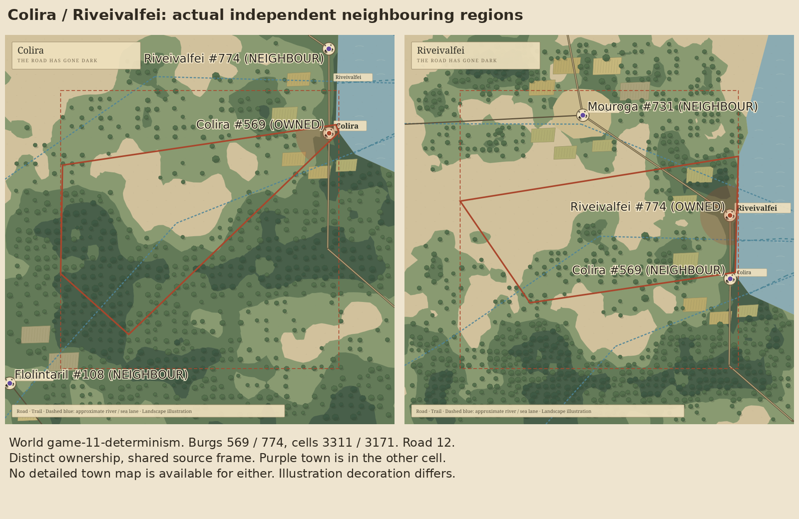
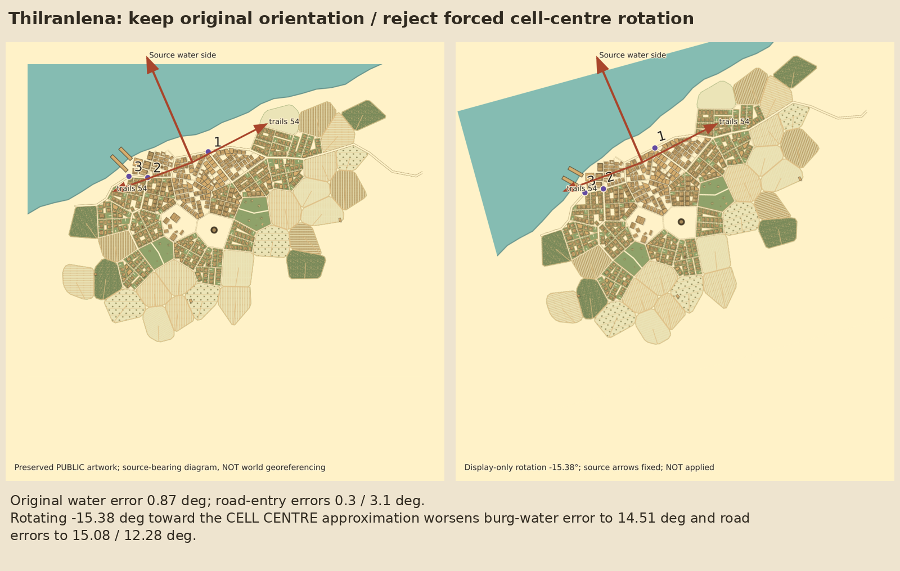

# GAME-73 — geographical coherence research

[Draft PR #55](https://github.com/marksprietsma-beep/road-has-gone-dark/pull/55), targeting
`fix/game-71-72-map-presentation`. An isolated, source-backed proof stacked on GAME-71/72
`ec6f8b5887826268366a9063f2099b34ae44d297`. All changes are under this directory.
The [initial critical assessment](ENGINEERING-ASSESSMENT.md) was published and its
push verified before implementation. Existing PRs #51–#54 are untouched and unmerged.
Linear was unavailable; [prepared update](LINEAR-UPDATE.md) awaits Mark's review.

**Finding:** the three preserved detailed maps already honour more broad source
context than the brief assumed. Nearby towns work in GAME-62's source frame, but
view visibility must remain separate from ownership. Relative scale is an illustration
policy, not a physical conversion. Preserve the accepted maps; avoid blanket rotation
or a replacement generator. [Full assessment](COHERENCE.md) · [pinned-engine feasibility and next step](FEASIBILITY.md).

## Review the real visual evidence

These are **actual librsvg renders** of source-derived diagnostics, accepted GAME-62
regional outputs and preserved public settlement SVGs. They are not Godot screenshots,
new settlement generation or invented game landscapes. Original/public art bytes
remain unchanged; embedded public art preserves existing privacy redactions.
Bearing arrows are diagrams; footprint tints are explicitly hypothetical. The
three inherited regional JSON files remain byte-identical to GAME-70.

[Phone-width overview](evidence/contact-sheet.png) ·
[Neighbouring regions](evidence/neighbour-comparison.png) ·
[Relative size guideline](evidence/relative-scale.png) ·
[Rejected rotation experiment](evidence/rotation-comparison.png)

| Case | Full phone sheet: world, source cells, regional context, available artwork | Side-by-side |
| --- | --- | --- |
| Batan | [PNG](evidence/batan-phone.png) | [PNG](evidence/batan-comparison.png) |
| Albanes | [PNG](evidence/albanes-phone.png) | [PNG](evidence/albanes-comparison.png) |
| Thilranlena | [PNG](evidence/thilranlena-phone.png) | [PNG](evidence/thilranlena-comparison.png) |
| Colira #569, cell 3311 | [PNG](evidence/neighbour-a-phone.png); detailed town unavailable | [Pair](evidence/neighbour-comparison.png) |
| Riveivalfei #774, cell 3171 | [PNG](evidence/neighbour-b-phone.png); detailed town unavailable | [Pair](evidence/neighbour-comparison.png) |




Every case also has a full 1000×1000 world-location/source-cell/region raster in
`evidence/`. Red solid lines identify the selected owned cell, red dashed squares
the viewing window and unpadded core, purple markers independent neighbours.
Source roads are solid brown; trails use their original route geometry; dashed blue
rivers are approximate cell chains (some blue paths are source sea lanes). The
added fringe is **20% of longest cell extent on each side**: a 1.4× span, not 1.2×.
The core square is an enclosing view, not a new region boundary. Town overlay numbers
identify original entrances in `*.town-assessment.json`, in listed order.

## Nearby settlement audit

Both complete canonical fixtures were scanned. The audit uses occupied-cell adjacency
and a once-built consecutive-route index rather than all-pairs distance/route scans.
Region contexts are reused per cell. Count visible original burgs only
(`i>0`, not removed/hidden); unordered pairs count once; occupied-cell windows count
once per unique parent cell. “Close” below means adjacent cells and distance ≤ half
the smaller actual GAME-62 window span, entirely in source units.

| Statistic | game-11-determinism | atlas-showcase |
| --- | ---: | ---: |
| Visible original burgs / occupied cells | 873 / 873 | 783 / 783 |
| Cells with multiple original burgs | **0** | **0** |
| Unordered adjacent-cell burg pairs | 631 | 588 |
| Close adjacent pairs, above definition | 170 | 151 |
| Adjacent pairs together in ≥1 / both viewing windows | 304 / 195 | 319 / 197 |
| Adjacent pairs with direct consecutive original road points | 77 | 75 |
| Occupied-cell windows containing a neighbour | 409 / 873 | 395 / 783 |
| Windows with a neighbour in added fringe | 320 / 873 | 308 / 783 |
| Windows where the fringe adds the first neighbour | 279 / 873 | 257 / 783 |
| Neighbour visibility records in core / added fringe | 141 / 385 | 154 / 388 |

Ordinary pinned Azgaar generation uses a single `cells.burg` slot and skips occupied
cells (`vendor/azgaar/src/generators/burgs-generator.ts`). GAME-62's context code accepts
arrays of original homes/visible burgs, but no genuine same-cell example exists in
these fixtures. We did not fabricate one. Adjacency does not guarantee visibility:
window sizes depend on real polygon extents. The fringe demonstrably adds useful
neighbour context; its margins shift at world edges as the accepted rule specifies.

**Selected proof:** Colira and Riveivalfei, world seed `game-11-determinism`, original
burg IDs **569/774**, source cells **3311/3171**, original road **12**, consecutive
source segment **12**. Coordinates **(917.13,420.16)/(917.12,417.24)**; separation
**2.920 source units**, with no kilometre claim. They are genuinely adjacent, coastal
and directly connected by original road vertices. Both windows show both towns.
Riveivalfei lies in Colira's **added fringe**; Colira lies in Riveivalfei's **unpadded
core**, yet still belongs to another cell. Neither has an approved detailed plan.
Other visible burgs (Flolintaril/Mouroga) retain their own original identities too.

Conceptually a player inspects the visible neighbour, resolves its world/burg/cell
identity, then opens **that different source cell**. A detailed town view requires
an available-art catalog entry; otherwise display unavailable. This research does
not add navigation, movement, route execution or travel times.

The atlas fixture uses seed **`atlas-showcase-06`**, not its filename. Numeric burg
IDs alone are not global identity. Both source SHA and structural world identity
are carried separately from names, alongside seed/cell/burg IDs.

[Full determinism audit](examples/game-11-determinism-neighbours.json) ·
[Full atlas audit](examples/atlas-showcase-neighbours.json) ·
[real case identities](examples/cases.json).

## Continuity results

Two independent accepted-generator regions were generated twice and their full
outputs matched exactly. Across the pair overlap: **four shared polygons identical**,
**81** wet-mask and globally anchored scalar samples agree; **10** route pieces and
**5** approximate river pieces agree to roughly **0.000001 source units**. Source
coordinate round-trip error is below **0.0000007**.

Illustration is less invariant: **514/480** tree primitives in the overlap, **470**
matching centres, all with differing source-space radii. There are **5/4** clearing/
field primitives. Existing globally anchored tree centres and scalar terrain are
reused; fixed display-unit object/clearing sizes, per-window exclusions and provider
marks explain seams. These are measured illustration discrepancies, not changed
roads/coasts. No accepted algorithm was altered. [Measurements](evidence/continuity.json)
and [executed log](evidence/continuity-log.txt).

## Small context interface and scale proof

[`src/context.mjs`](src/context.mjs) exports `settlementContext(world, sidecar,
canonicalSha, burgId)`. It reuses `buildCellContext`, exact original cell polygons,
source routes and actual wet neighbours. The plain JSON has:

- Name-independent identity and exact original position/flags/biome.
- Source-derived water bearing and exact shore edges; separate burg versus cell-centre anchors.
- Source-backed boundary-crossing road/trail approaches; approximate river-chain proximity.
- Relative source class/population rank and bounded **aesthetic**, not metric, envelopes.
- Original ownership, unpadded core, added fringe and explicit unknowns/provenance/confidence.

`source_exact`, `source_derived`, `inferred_visual` and `unknown` are explicit.
No provider/planner is called by the adapter. Missing port flags, gate positions,
river width, fine farmland geometry and world-to-town scale stay unknown. Supplied
geometry sidecars are original vertices/cell IDs and match canonical SHA/seed/provider;
no fixture or save schema is changed. Their committed copies make the proof durable.
Example contexts are under `examples/`. Detailed-art availability is an external
research catalog annotation, not a fact inferred from source geography.

Four real scale examples cover village, ordinary town, fortified capital and port:
Batan, **Capja #297** (no detailed map), Albanes, Thilranlena. Proposed fractions are
2.00/5.12/7.10/7.82% of each respective cell, capped at 12% before coastal clipping.
The model's assumptions, real area/count measurements and raw-provider-unit mismatch
are explicitly separated in [COHERENCE.md](COHERENCE.md) and
[relative-scale.json](examples/relative-scale.json). This does not establish population
census values, region kilometres, hex travel distance or an approved footprint policy.

## Executed tests and reproduction

Run from the existing checkout root; Node 24+, Python/Pillow, DejaVu fonts and
librsvg `rsvg-convert` are required. No new GPL dependency. Set `RSVG_CONVERT` to the
installed binary if absent from PATH; this instance uses
`/tmp/game70-system/usr/bin/rsvg-convert` (2.60.0). The proof needs no running service,
Godot viewer, browser automation or application main-scene change.

```sh
node research/game73/scripts/build.mjs
node research/game73/scripts/continuity.mjs
node research/game73/scripts/access-check.mjs
node research/game73/scripts/visuals.mjs
python3 research/game73/scripts/render.py
node --test research/game73/tests/*.test.mjs
node research/game73/scripts/verify-engine.mjs
```

Build reuses the committed, verified sidecars. If reproducing them independently,
use the existing pinned Azgaar generator's `--geometry-output` to an ignored temporary
path, and compare canonical replay bytes before use. Build generates only the two
new neighbouring regions; approved settlement outputs are never regenerated.

| Actually executed | Result / evidence |
| --- | --- |
| New GAME-73 source/context/fringe/scale/visual/scope tests | 24 PASS; [log](evidence/research-tests.txt) |
| Accepted neighbouring region double generation | Deterministic PASS; [build log](evidence/build-log.txt) |
| Exact shared source continuity + 81 samples | PASS; [log](evidence/continuity-log.txt) |
| Actual librsvg render pipeline | 19 source/region/town/rotation rasters, five phone sheets and composed comparisons; PASS; [log](evidence/render-log.txt), [hash manifest](evidence/visual-manifest.json) |
| Pinned engine source/license inspection verification | 7 file hashes PASS; engine unexecuted; [log](evidence/engine-source-tests.txt) |
| Original GAME-62 generator assertions | Six-case replay/privacy/IDs/geometry PASS; [log](evidence/game62-source-tests.txt) |
| Existing source projection / geography sidecar checks | PASS, both seeded worlds; [projection](evidence/game62-projection-tests.txt), [geography](evidence/game62-geography-tests.txt) |
| Original GAME-62 Godot smoke | Six scenes, privacy/inspection/overlays/reset PASS; [log](evidence/game62-godot-tests.txt) |
| Original save/world smoke | PASS; [log](evidence/save-world-tests.txt) |
| GAME-67 model | 21 PASS; [log](evidence/game67-model-tests.txt) |
| GAME-69 art/hash/geometry/privacy | 9 PASS; [log](evidence/game69-art-tests.txt) |
| GAME-70 functional source tests | 9 PASS; [log](evidence/game70-source-tests.txt) |
| GAME-71/72 functional saved-evidence tests | 6 PASS; [log](evidence/game71-72-evidence-tests.txt) |

Old task-specific scope guards require no production changes since GAME-67 / only
GAME-70 additions / only GAME-71/72 presentation paths. Those conflict with the
already published stack or this new authorised research directory, so only their
functional assertions were selected. Our new scope guard requires **every** changed
path versus the verified GAME-71/72 base to be under `research/game73/`; original
fixture/art/region bytes are also checked. No functional assertion was rewritten.
Native GAME-70 graphical navigation and browser interaction were not rerun for this
data-only research; their implementation and prior evidence remain byte-identical.
No new Godot viewer was built, so no new Godot screenshot is claimed.

Visual inspection caught librsvg blocking parent-directory art references and root
annotation insertion encountering nested icon SVGs. The isolated proof now embeds
verified public SVG bytes and inserts overlays at the root closing tag. A raster
content check rejects missing town detail. A first source-byte test exceeded Node's
default subprocess output buffer; its buffer limit was corrected, assertions retained.
Final logs above reflect executed passing runs.

## Review limits

This is evidence for two canonical fixtures and the preserved examples, not broad
provider seed validation or physical calibration. The rotation candidate is rejected;
known shoreline character is already coherent. Harbour/land-trail semantics, provider
scale disagreements and illustration seams remain documented. Full footprint packing,
water masks for a future shape fit and gameplay access are not implemented.

Keep this PR DRAFT. Mark reviews evidence; do not mark GAME-73 accepted, merge any PR,
start GAME-19, regenerate approved settlements or automatically implement recommendations.
