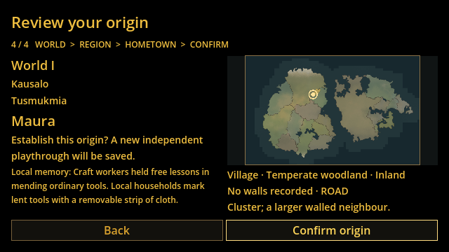
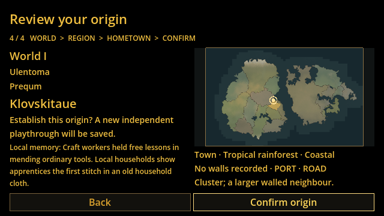
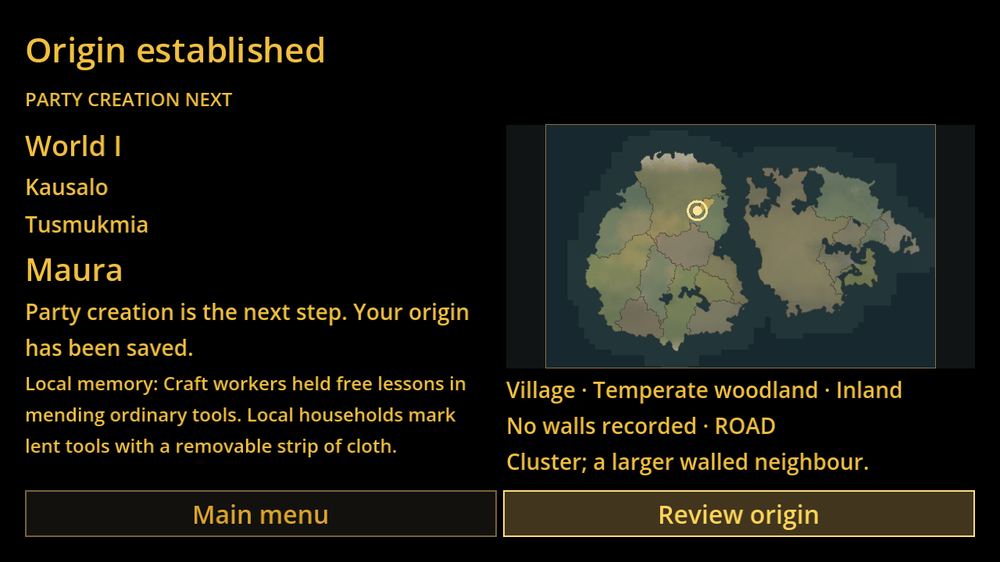

# Expanded public origin demonstration

Separate GAME-78 integration stacked on draft #60 at verified **66b88b9a9fbdca517fc5f396b3561d3b003b1c9c**. GAME-75 #58 and GAME-77 #59/#60 remain unchanged.

Core provider implementation is draft [#61](https://github.com/marksprietsma-beep/road-has-gone-dark/pull/61). Exact reproducible core milestone **746369f278ef009ba6f589e84e508c2bd3ed3e9c** supplies the fact/renderer source hashes and pack digest in `data/manifest.json`. Checkout that commit in a separate developer clone and run:

```sh
node research/game78-integration/generate-demo.mjs /path/to/pinned-core-checkout
node research/game78-integration/verify-data.mjs
python3 research/game78-integration/run-tests.py
# Under xvfb-run / an actual display:
python3 research/game78-integration/run-tests.py --visual
```

The player UI has **no Node invocation**. It loads only the existing GAME-77 allowlisted eight-field `record_id` projection, pinned by file SHA. Full schema-2 sidecars stay in research data; secret facts are never loaded by the UI. Same immutable Maura771, Klovskitaue25 and Atlas760 identities, memory plus tradition, stored before rendering. Other/generated towns retain source-backed GAME-75 facts and no invented lore fallback.

Changes to production UI are limited to the research projection path/digest and a compact secondary lore line (12-unit font, inline label) so all controls remain visible at the approved logical viewport. No scene, save system, factual context or map-generation change. This is a three-town proof, not installed world-library enrichment or character creation.

## Actual checks

* Independent Node sidecar/public digest/source/fact-reference verification: **48 assertions**.
* Godot public adapter: **33 checks**, 0 failures.
* Actual Godot mouse/render/confirmation/reload/review: **55 checks**, 0 failures; footer containment explicitly checked at 640×360 and 1280×720. Screenshots inspected.
* Existing GAME-75 actual source context: **105,425 checks**, 0 failures across two fixtures and three fresh generated worlds; five independent source audits passed.
* Existing GAME-75 input/render: **108 checks**, 0 failures.
* Existing GAME-7 persistence smoke passed; GAME-74 source/save3,973, reload-failure26 and actual render/input17 checks passed. GAME-76 six genuine helper generations, lifecycle57 and actual render/input20 checks passed; canonical JSON5 passed. Proofs/logs retained under `evidence/regressions`. Final native CI status is visible on the draft PR.

The first longer text pushed a footer outside the viewport. Real click tests exposed it; the secondary line was compacted and the test strengthened, with no truncation or fabricated substitute text. Canonical fixture bytes remain unchanged. Personal names/cultural authenticity and large corpus editorial limits are documented in core GAME-78, not resolved by this UI demonstration.




