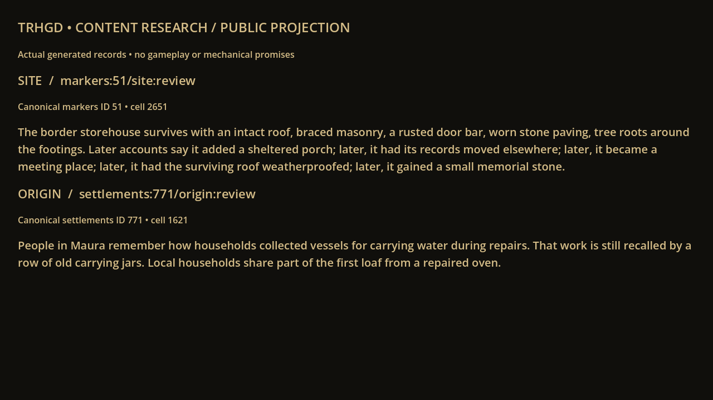
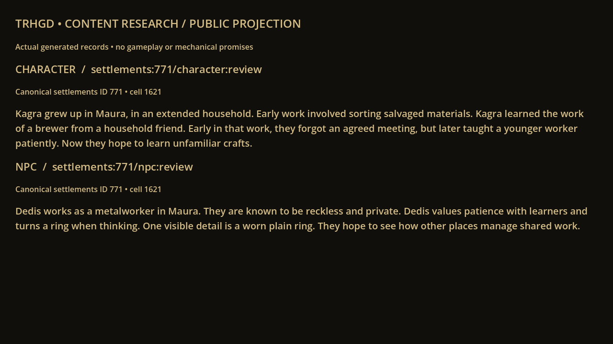
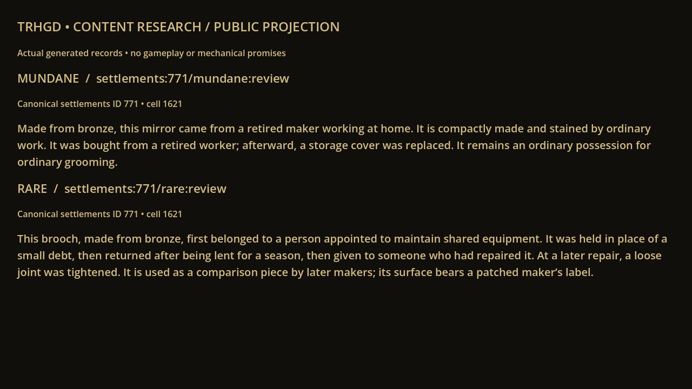
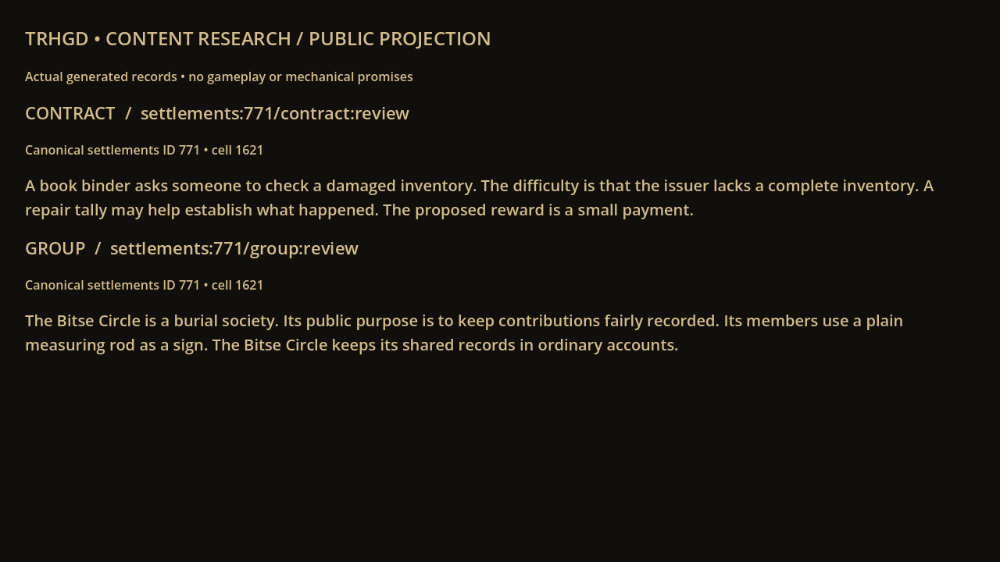

# Actual Godot content review pages

Godot 4.6.3, 1280×720, public-projected generated records. These are labelled research diagnostics, not fabricated geography or gameplay screenshots. Full facts, heard rumours and developer secrets are separately inspectable in [the review](REVIEW.md).

The separate [expanded origin demonstration draft #62](https://github.com/marksprietsma-beep/road-has-gone-dark/pull/62) contains real 640/1280 onboarding captures without changing GAME-75/#60 branches.
